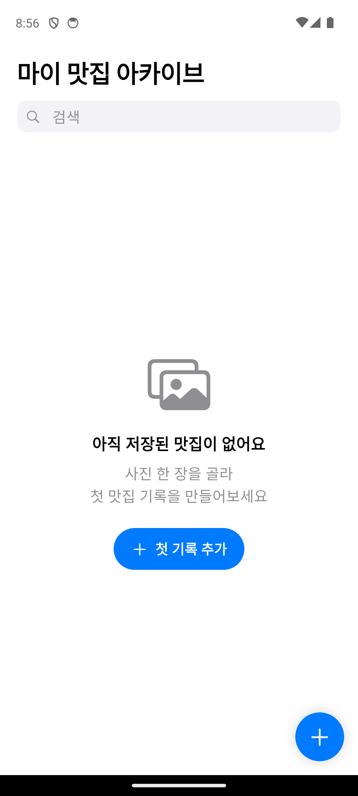
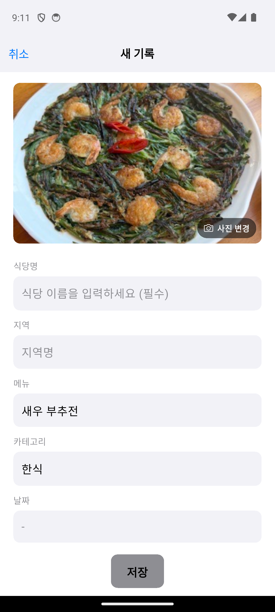
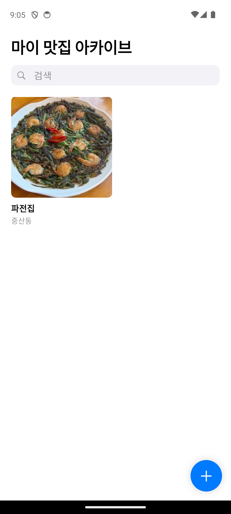

# 책 독자라면 여기부터

GitHub를 처음 보더라도 괜찮습니다. 이 페이지에서 지금 필요한 길 하나만 고르면 됩니다.

## 지금 어떤 단계인가요?

| 지금의 나 | 바로 할 일 |
|---|---|
| 책을 처음부터 따라 만드는 중 | 이 저장소의 완성 코드를 복사하지 않고, 책에서 자신의 앱과 문서를 먼저 만듭니다. 저자 예시가 필요할 때만 [책 실습 문서](#저자-예시-문서가-필요할-때)를 엽니다. |
| 8~14장에서 막혀 완성 결과와 비교하고 싶음 | 아래의 [출판 기준 자료 ZIP](https://github.com/kimsol1134/my-food-archive/archive/refs/tags/book-v1.0.1.zip)을 별도 폴더에 받아 비교합니다. |
| Mac 또는 Windows에서 Android 앱을 만드는 중 | [Android 기술 설계서](docs/TRD_android.md)와 [Android 구현계획서](docs/Implement_plan_android.md)를 사용합니다. |
| 15~18장에서 Google Play 배포를 진행 중 | [Android 온라인 실습 자료](https://kimsol1134.github.io/my-food-archive/android/)에서 현재 장을 선택합니다. |

## 완성 앱은 이렇게 생겼습니다

사진 한 장을 고르면 AI가 메뉴와 카테고리를 채우고, 식당명을 더해 나만의 맛집 기록으로 저장합니다.

  
  
  

빈 화면에서 시작해 사진을 분석하고, 첫 맛집 기록을 저장하는 흐름입니다. Android 화면이지만 책의 iPhone 앱도 같은 기능과 구성을 사용합니다.

## 완성 참고본 내려받기

**[책과 맞춘 `book-v1.0.1` ZIP 내려받기](https://github.com/kimsol1134/my-food-archive/archive/refs/tags/book-v1.0.1.zip)**

1. 위 링크를 누릅니다.
2. 내려받은 ZIP 파일의 압축을 풉니다.
3. 생긴 폴더는 자신이 만들던 프로젝트와 **다른 곳에 둡니다**.
4. 책 실습 폴더를 이 완성 참고본으로 덮어쓰지 않습니다. 막힌 화면이나 문서만 나란히 비교합니다.

압축을 푼 뒤에는 파일이 많이 보여도 정상입니다. 대부분은 완성 앱을 움직이는 파일이라 하나씩 열 필요가 없습니다.

- `docs` 폴더: 책에서 만드는 기획서와 설계 문서의 저자 예시
- 그 밖의 폴더: iPhone과 Android에서 실행되는 완성 앱
- `README.md`: 자료 전체 안내

## 저자 예시 문서가 필요할 때

저자 예시본은 정답지가 아니라 비교 자료입니다. 앱 이름과 기능이 달라지면 여러분의 문서도 달라지는 것이 정상입니다.

### 모든 독자가 함께 쓰는 문서

- [기획서](docs/PRD.md)
- [화면 연결 구조](docs/IA.md)
- [사용 흐름](docs/Usecase.md)
- [색상과 화면 디자인](docs/Design_guide.md)

### 만드는 앱에 따라 고르는 문서

- iPhone 앱: [기술 설계서](docs/TRD.md) · [구현계획서](docs/Implement_plan.md)
- Android 앱: [기술 설계서](docs/TRD_android.md) · [구현계획서](docs/Implement_plan_android.md)

문서 속 개발자 이름, 이메일, 앱 식별 이름, Firebase 프로젝트는 저자의 값입니다. 자신의 앱에는 책에서 만든 본인 값을 사용합니다.

## 완성 참고본에서 AI 입력이 작동하지 않을 때

이 저장소를 내려받는 것만으로 저자의 AI 사용 권한까지 복사되지는 않습니다. 자신의 Firebase 프로젝트와 App Check를 연결해야 AI 자동 입력이 작동합니다. iPhone은 책 10장, Android는 온라인 실습 자료의 Firebase 안내를 따릅니다.

Firebase 연결 전에도 맛집 기록 저장·검색·수정·삭제는 확인할 수 있습니다. AI 기능만 작동하지 않는 상태는 앱 전체가 망가진 것이 아닙니다.

## 막혔을 때 보내 주실 내용

[지원 및 문의 페이지](https://kimsol1134.github.io/my-food-archive/support/)에서 이메일 또는 오류 제보를 선택할 수 있습니다. 아래 네 가지가 있으면 원인을 훨씬 빨리 찾을 수 있습니다.

- 읽고 있는 장과 절
- 사용하는 컴퓨터: Mac 또는 Windows
- 만드는 앱: iPhone 또는 Android
- 화면에 보이는 오류 문장
- 오류 직전에 한 작업

스크린샷에서는 비밀번호, 인증번호, 결제 정보와 비공개 테스트 참여 링크를 가려 주세요.
