# Android 앱을 Google Play 내부 테스트에 올리고 정식 공개까지 가기

Android 앱 개발과 Google Play 배포가 처음이라면 1절부터 순서대로 진행합니다.

이 자료는 두 단계로 진행합니다.

1. **첫 목표 — 내부 테스트 설치:** 14장까지 만든 Android 앱을 Google Play Console에 올리고, 실제 Android 기기에 설치합니다.
2. **최종 목표 — Google Play 정식 공개:** 앱을 다듬은 뒤 비공개 테스트, 프로덕션 접근 신청, 심사를 거쳐 정식 링크를 만듭니다.

15~16장에서는 첫 목표까지 진행하고, 17~18장에서는 정식 공개를 준비합니다. 새 개인 개발자 계정의 비공개 테스트 12명·14일 요구사항도 실제 진행 순서대로 다룹니다.

온라인 자료를 한 번 열었을 때 아래 범위를 끝낸 뒤 책으로 돌아갑니다.

| 지금 읽는 곳 | 온라인 자료를 여는 시점과 범위 | 책으로 돌아갈 곳 |
|---|---|---|
| 책 15장 | 1~11절 | 책 15.5절로 돌아가기 |
| 책 16장 | 책 16.4절까지 앱을 수정한 뒤 9.1절만 진행 | 책 16.5절로 돌아가기 |
| 책 17장 | [`release-roadmap.md`](release-roadmap.md)의 1~7절 | 책 17.5절의 점검 프롬프트로 마무리 |
| 책 18장 | [`release-roadmap.md`](release-roadmap.md)의 8~10절 | 책 18.3절로 돌아가기 |

15장을 읽는 중이라면 11절까지만 진행하고 책으로 돌아옵니다. 12절부터는 정식 공개를 준비하는 흐름이라, 16장에서 앱의 첫인상을 다듬은 뒤에 진행하는 편이 좋습니다.

> 기준일: 2026년 7월 12일
> Google Play Console 화면 이름과 요구사항은 바뀔 수 있습니다. 실제 진행 전에는 Play Console에 표시되는 최신 안내를 우선합니다.
> 캡처는 촬영 후 자르기·가림·합성·주석을 하지 않은 원본만 사용합니다. 계정 이메일과 다른 앱 이름은 원본 그대로 둡니다. 주소, 결제 정보, 비밀번호, 인증서 지문이 보이는 화면은 사용하지 않습니다.

---

## 1. 처음 보는 Google Play 용어

시작하기 전에 이 자료에서 반복해서 사용하는 말만 짧게 알아둡니다.

| 용어 | 뜻 |
|---|---|
| Google Play Console | 앱을 등록하고 테스트·공개 상태를 관리하는 웹사이트 |
| Android App Bundle(AAB) | Google Play에 업로드하는 Android 배포 파일. 확장자는 `.aab` |
| 패키지 이름 | Google Play와 Firebase가 앱을 구분하는 고유 ID. 예: `com.example.myapp` |
| `versionCode` | Google Play가 앱 업데이트 순서를 구분하는 숫자. 새 빌드를 올릴 때마다 증가 |
| 키스토어 | 업로드 키를 안전하게 보관하는 파일. GitHub에 올리면 안 됨 |
| 업로드 키 | 내가 올린 앱 파일이 맞다는 것을 증명하는 서명 키 |
| Play App Signing | 사용자에게 전달할 앱의 최종 서명을 Google Play가 관리하는 기능 |
| App Check·Play Integrity | Firebase가 정상 Android 앱의 요청인지 확인하는 보안 기능 |
| 트랙 | 앱을 받을 사람을 나누는 배포 통로 |
| 내부 테스트 | 나와 소수의 지정 테스터가 빠르게 설치하는 첫 테스트 단계 |
| 비공개 테스트 | 정식 공개 전에 더 많은 지정 테스터가 참여하는 단계 |
| 프로덕션 | 심사를 거쳐 모든 사용자가 설치할 수 있게 공개하는 단계 |

Play Console 메뉴는 **테스트 및 출시**, **앱 콘텐츠**, **스토어 등록정보**처럼 역할별로 나뉩니다. 각 절에는 현재 찾아야 할 메뉴와 버튼이 순서대로 나옵니다.

---

## 2. 전체 흐름

이번 절에서는 실제로 누를 순서 일곱 단계를 먼저 정리합니다.

1. Google Play Console 개발자 계정을 준비합니다.
2. Play Console에 새 앱을 만듭니다.
3. 클로드 코드에게 Google Play용 앱 번들 파일을 만들게 합니다.
4. 내부 테스트 트랙에 앱 번들을 올립니다.
5. 테스터 이메일 목록을 만들고 참여 링크를 받습니다.
6. 실제 Android 기기에서 링크를 열고 앱을 설치합니다.
7. 첫 테스터에게 무엇을 눌러 볼지 보냅니다.

이번 절의 범위는 내부 테스트로 앱을 내 폰에 설치하고 첫 테스터에게 안내하는 것까지입니다. Google Play 개인 개발자 계정의 비공개 테스트 12명/14일 준비는 16장에서 앱을 다듬은 뒤 이 자료의 12절에서 시작합니다.

아래 표에서 직접 해야 할 일과 클로드 코드에게 맡길 일을 구분해 확인합니다.

| 사람이 직접 해야 하는 일 | 클로드 코드에게 맡길 수 있는 일 |
|---|---|
| Play Console 개발자 계정 가입 | 프로젝트의 Android 설정 점검 |
| 결제, 본인 확인, 기기 확인 | 패키지 이름과 버전 번호 확인 |
| Play Console에서 앱 만들기 | 업로드 키 생성과 배포용 서명 설정 |
| 내부 테스트 트랙에 파일 업로드 | Android App Bundle 빌드 |
| 테스터 이메일 목록 만들기 | 오류 로그 해석과 수정 |
| 실제 기기에서 설치 확인 | 재빌드와 versionCode 증가 |

계정, 결제, 본인 확인, 비밀키 비밀번호는 사람이 직접 처리합니다. 반대로 빌드, 파일 경로 확인, 오류 해석은 클로드 코드가 훨씬 잘합니다.

한 가지 미리 말해 두겠습니다. Play Console 화면은 자주 바뀌어서, 이 자료의 설명과 실제 화면이 다를 수 있습니다. 어느 화면에서든 길을 잃으면 아래 프롬프트를 그대로 쓰세요. 이 자료 전체에서 통하는 비상구입니다.

```text
Google Play Console 화면이야.
첨부한 화면을 보고 다음 내용을 알려줘.

1. 지금 어느 단계인지
2. 다음에 눌러야 할 버튼
3. 선택하면 안 되는 항목이 있는지
```

---

## 3. 준비물

진행 전에 아래를 확인합니다.

| 준비물 | 설명 |
|---|---|
| Google 계정 | Play Console 개발자 계정에 사용할 계정입니다. Google 안내 기준으로 Play Console 계정 가입은 만 18세 이상이어야 합니다. |
| 결제 수단 | Google Play 개발자 계정은 일회성 등록비가 있습니다. 공식 안내 기준으로 25달러입니다. 선불카드는 거부될 수 있고, 실제 결제 가능 수단은 가입 화면에서 확인합니다. |
| 실제 Android 기기 | 새 개인 개발자 계정은 정식 공개 전 Play Console 모바일 앱으로 Android 기기 접근 확인이 필요합니다. 내부 테스트 설치 확인에도 실제 기기가 가장 좋습니다. |
| 14장까지 완성한 Android 프로젝트 | 4장에서 직접 만든 기술 설계서(`TRD_android.md`)와 7장에서 만든 구현계획서(`Implement_plan_android.md`)를 따라 완성한 앱입니다. 저장소에 있는 [`TRD_android.md`](../TRD_android.md)와 [`Implement_plan_android.md`](../Implement_plan_android.md)는 저자의 참고본이라, 내가 만든 파일과 내용이 달라도 됩니다. |
| 앱 패키지 이름 | 예: `com.solkim.my_food_archive`. 이 예시는 그대로 복사하지 말고, 본인의 영문 이름이나 브랜드를 넣어 고유하게 정합니다. Play Console에 한 번 올라간 패키지 이름은 나중에 바꾸기 어렵습니다. |
| 개인정보처리방침 URL | 내부 테스트만 할 때는 당장 막히지 않을 수 있지만, 비공개 테스트, 공개 테스트, 정식 공개로 넘어가려면 준비해야 합니다. 만드는 방법은 13.1절에 있습니다. 지금은 없어도 됩니다. |

#### Windows 사용자

Windows에서 Android 앱을 만들고 있다면 이 자료를 그대로 따라갈 수 있습니다.

다만 Android Studio, Flutter, JDK, Android SDK가 이미 준비되어 있어야 합니다. 6장, 7장, 9장의 Windows/Android 안내를 먼저 마친 뒤 진행하세요. Windows에서 처음부터 끝까지 이어서 진행하는 통합 흐름은 [`windows-android-one-file-guide.md`](../windows-android-one-file-guide.md)에 있습니다.

문서의 파일 경로는 책 전체 흐름에 맞춰 `/`로 적지만, Windows 탐색기나 PowerShell에서는 `build\app\outputs\bundle\release\app-release.aab`처럼 `\`로 보일 수 있습니다. 같은 파일입니다.

#### Mac에서 Android 앱 만들기

Mac에서도 이 자료를 따라갈 수 있습니다.

앱을 만드는 대상이 Android라면 Xcode와 TestFlight가 아니라 Android Studio와 Google Play Console을 사용합니다.

---

## 4. Google Play Console 개발자 계정 만들기

먼저 Google Play Console에 들어갑니다.

[https://play.google.com/console](https://play.google.com/console)

Google 계정으로 로그인하면 개발자 계정 만들기 절차가 시작됩니다. 개인으로 앱을 올릴 예정이라면 개인 개발자 계정을 선택합니다. 회사 이름으로 앱을 올릴 예정이라면 조직 계정을 선택해야 합니다.

가입 과정에서는 이름, 주소, 전화번호, 개발자 이름, 결제 정보 등을 확인합니다. 개발자 이름은 나중에 Google Play에 표시될 수 있으니, 임시 별명처럼 보이지 않게 정합니다.

중간에 앱 경험, 개발 목적, 앱 수 같은 질문이 나올 수 있습니다. 이것은 Google이 계정 상태를 파악하기 위한 질문입니다. 아직 앱이 하나뿐이라면 있는 그대로 답하면 됩니다.

새 개인 개발자 계정은 정식 공개 전 Android 기기 접근 확인이 필요합니다. 이때는 Play Console 모바일 앱을 실제 Android 기기에 설치하고, 개발자 계정으로 로그인해 확인을 마칩니다. 정부 발급 신분증이나 결제 카드처럼 법적 이름과 연결된 정보를 요구할 수도 있습니다. 화면에 표시되는 안내를 기준으로 입력 항목을 하나씩 확인합니다.

본인 확인에는 며칠이 걸릴 수 있습니다.

가입 중 막히는 화면이 나오면 민감정보가 보이지 않는 화면만 원본으로 캡처해 클로드 코드에게 묻습니다. 결제 정보나 주소가 보이는 화면에서는 오류 문구와 버튼 이름만 텍스트로 전달합니다.

```text
Google Play Console 개발자 계정 가입 중인데, 이 화면에서 다음에 무엇을 눌러야 할지 모르겠어.
첨부한 스크린샷을 보고 진행 방법을 알려줘.
```

개발자 계정이 만들어지면 Play Console 홈으로 들어갈 수 있습니다. 이제 새 앱을 등록할 준비가 끝났습니다.

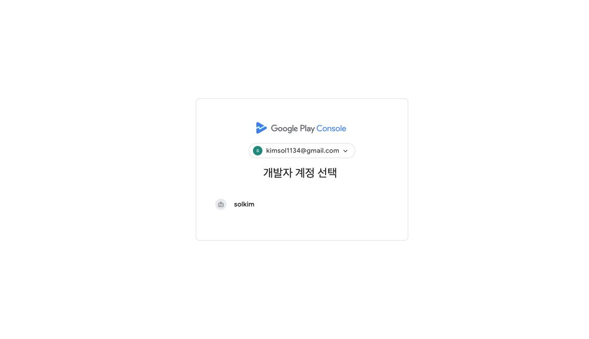

계정 생성이 끝나면 **Android 개발자 인증**에서 등록된 패키지 이름을 확인할 수 있습니다.

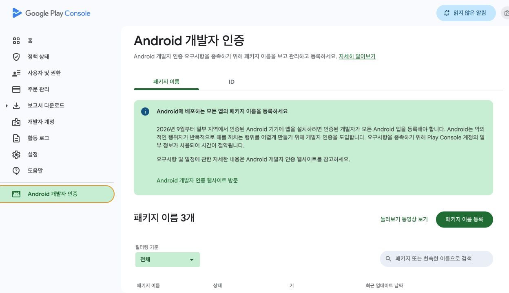

---

## 5. Play Console에 새 앱 만들기

이제 Play Console에 앱을 하나 만듭니다.

Play Console 홈에서 **앱 만들기**를 누릅니다.

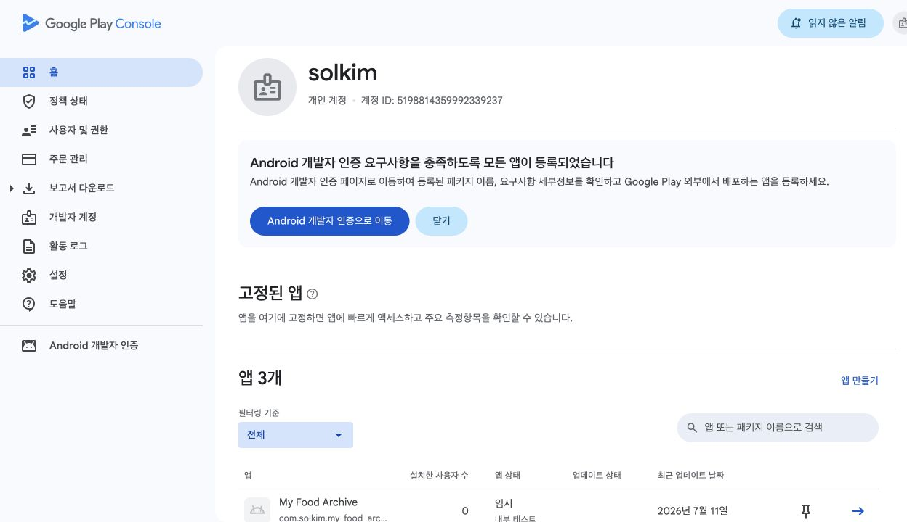

새 앱 화면에서는 처음에 아래 정보를 입력합니다.

| 항목 | 입력 예시 | 설명 |
|---|---|---|
| 앱 이름 | `My Food Archive` 또는 `마이 맛집 아카이브` | Google Play에 보일 이름입니다. 나중에 바꿀 수 있지만 처음부터 자연스럽게 정합니다. |
| 기본 언어 | 한국어 | 본문과 앱 설명을 한국어로 쓸 예정이면 한국어를 고릅니다. |
| 앱 또는 게임 | 앱 | 게임이 아니므로 앱입니다. |
| 무료 또는 유료 | 무료 | 한번 유료로 만들면 무료 전환은 가능하지만, 무료에서 유료 전환은 제한될 수 있습니다. 첫 앱은 무료가 단순합니다. |
| 선언 | 개발자 프로그램 정책 동의 | 화면에 표시되는 약관과 정책을 확인합니다. |

앱을 만들면 대시보드가 열립니다.

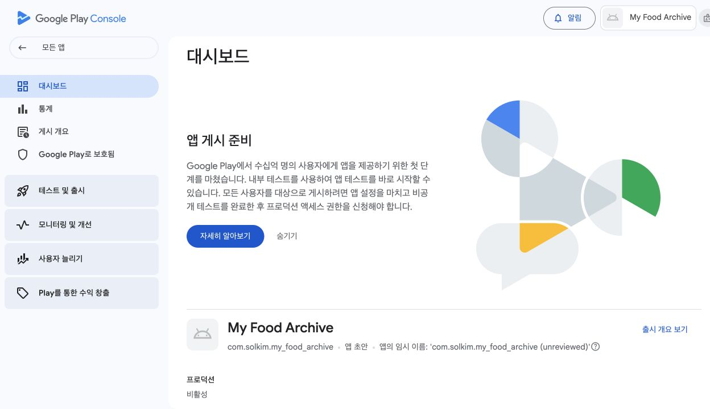

대시보드에는 해야 할 일이 많이 보일 수 있습니다.

스토어 등록정보, 앱 콘텐츠, 내부 테스트, 앱 서명, 데이터 안전, 콘텐츠 등급 같은 메뉴가 한꺼번에 나오기 때문입니다. 이 자료에서는 먼저 내부 테스트에 필요한 흐름만 사용합니다.

> 패키지 이름은 처음 앱 번들을 올리는 순간 고정됩니다.
>
> 예를 들어 `com.solkim.my_food_archive`로 올리면 나중에 같은 앱을 `com.example.myfood`처럼 바꿔 올릴 수 없습니다. 앱 이름은 바꿀 수 있지만, 패키지 이름은 앱의 주민등록번호에 가깝습니다. 첫 업로드 전에 클로드 코드에게 한 번 더 확인하게 합니다.

---

## 6. 클로드 코드에게 Google Play용 앱 번들을 만들게 하기

Google Play에 올리는 Android 앱 파일은 보통 **Android App Bundle**입니다. 파일 확장자는 `.aab`입니다.

앱 번들은 사용자가 설치할 최종 앱을 Google Play가 기기별로 나누어 만들 수 있도록 묶어 둔 파일입니다. 우리가 코드를 통째로 올리는 것이 아니라, Google Play가 받을 수 있는 배포용 결과물을 만드는 것입니다.

여기서 중요한 말이 하나 더 나옵니다. **앱 서명**입니다.

앱 서명은 이 앱이 같은 개발자에게서 나온 앱이라는 확인 표시입니다. Google Play에서는 Play App Signing을 사용합니다. 쉽게 말하면 Google Play가 실제 사용자에게 나가는 앱 서명을 안전하게 관리하고, 우리는 업로드할 때 쓰는 **업로드 키**로 앱 번들을 서명해 올립니다.

클로드 코드에게 Google Play 내부 테스트에 올릴 앱 번들을 만들어 달라고 부탁합니다.

```text
Google Play 내부 테스트에 올릴 Android App Bundle을 만들어줘.
네가 할 수 있는 작업은 직접 진행하고, 비밀번호처럼 내가 직접 입력해야 할 때만 알려줘.
```

업로드 키를 새로 만들 때 사람은 전용 **비밀번호**를 정하고 터미널의 숨김 입력란에 직접 입력합니다.

Google 계정 비밀번호를 쓰면 안 됩니다. 이 열쇠 전용의 새 비밀번호를 만드세요. 잊어버리면 재설정 절차를 밟아야 하니, 평소 쓰는 비밀번호 보관 방법에 적어 둡니다.

비밀번호를 채팅에 붙여 넣지 마세요. 코딩 에이전트는 `keytool`을 실행하고 입력 직전에 멈출 수 있습니다. 그때 사용자가 터미널에 직접 입력하거나 비밀번호 관리자를 사용합니다. `key.properties`, 키스토어, 비밀번호는 GitHub에 올리지 않습니다.

**팁 — Windows에서 keytool 오류가 날 때**

Windows에서 업로드 키를 만들 때 `keytool` 명령어가 없다는 오류가 나올 수 있습니다.

이건 앱 문제가 아니라 Java 경로 설정 문제일 때가 많습니다. keytool은 보통 Android Studio 안에 이미 들어 있으므로, 클로드 코드에게 위치를 찾아 직접 실행하게 하면 대부분 해결됩니다.

```text
Windows에서 keytool 명령어가 없다는 오류가 나왔어.
필요한 위치를 찾아 업로드 키 생성을 계속 진행해줘.
내가 직접 입력해야 할 때만 알려줘.
```

클로드 코드는 보통 아래 일을 직접 처리합니다.

- `pubspec.yaml`의 `version` 값 확인
- Android 패키지 이름 확인
- 업로드 키가 없으면 `keytool`을 실행하고 사용자가 비밀번호를 터미널에 직접 입력하도록 대기
- `key.properties` 작성과 release 서명 설정 연결
- `targetSdk`가 기준에 못 미치면 직접 수정
- `key.properties` 같은 민감 파일이 Git에 올라가지 않는지 확인
- `flutter build appbundle --release` 실행
- `.aab` 파일 경로 안내

새 Flutter 프로젝트는 release 빌드가 임시로 디버그 키로 서명되도록 만들어져 있습니다. 위 과정은 그 임시 상태를 업로드용 진짜 서명으로 바꾸는 일입니다. 사람이 설정 파일을 열어 고칠 필요는 없습니다.

> `versionCode`는 Android 앱 파일의 빌드 번호입니다. 같은 앱에 같은 `versionCode`를 두 번 올릴 수 없습니다. 다시 올릴 때는 숫자를 올려야 합니다.
>
> Flutter에서는 `pubspec.yaml`의 `version: 1.0.0+6`에서 `1.0.0`이 `versionName`, `+6`이 `versionCode`가 됩니다.

#### 업로드 키는 잃어버리면 곤란합니다

업로드 키는 Google Play에 앱을 올릴 때 쓰는 열쇠입니다.

이 파일과 비밀번호는 GitHub에 올리면 안 됩니다. 다른 사람이 앱을 대신 올릴 수 있는 통로가 될 수 있습니다. 프로젝트 폴더 안에 두더라도 `.gitignore`로 제외되어 있는지 확인합니다.

나중에 키를 잃어버리면 Google Play Console에서 재설정 절차를 밟아야 합니다. 처음부터 안전한 위치에 따로 보관하세요.

빌드가 끝나면 보통 아래와 같은 파일이 생깁니다.

```
build/app/outputs/bundle/release/app-release.aab
```

Windows에서는 같은 파일이 아래처럼 보일 수 있습니다.

```
build\app\outputs\bundle\release\app-release.aab
```

이 파일을 다음 단계에서 Play Console에 올립니다.

#### Firebase AI와 App Check 출시 게이트

이 앱은 사진 분석에 Firebase AI Logic을 사용하므로 `.aab`가 만들어졌다는 사실만으로 배포 준비가 끝나지 않습니다. 2026년 7월부터 AI Logic 설정 마법사에서 App Check 적용이 자동으로 켜질 수 있으므로, 아래 일곱 항목을 실제 출시 빌드 기준으로 확인합니다.

1. Firebase 프로젝트에 Android 앱의 실제 패키지 이름을 등록합니다.
2. `android/app/google-services.json`과 `lib/firebase_options.dart`가 현재 Firebase 프로젝트에서 생성된 파일인지 확인합니다.
3. Android Gradle에 `com.google.gms.google-services` 플러그인이 적용되었는지 확인합니다.
4. 디버그 빌드는 App Check debug provider, 출시 빌드는 Play Integrity provider를 쓰는지 확인합니다.
5. Play Console의 Play App Signing에서 **앱 서명 인증서 SHA-256**을 Firebase Android 앱에 등록합니다. 업로드 키나 디버그 키의 SHA-256으로 대신하지 않습니다.
6. Play Console 앱과 Firebase가 같은 Google Cloud 프로젝트의 Play Integrity API를 사용하도록 연결하고, Firebase AI Logic의 App Check 적용 상태를 확인합니다.
7. 내부 테스트에서 Google Play로 설치한 출시본으로 음식 사진 한 장을 분석해 메뉴명과 카테고리가 채워지는지 확인합니다.

마지막 항목이 실패하면 프로덕션으로 승격하지 않습니다. 에뮬레이터나 USB 디버그 설치 성공은 Play Integrity가 붙은 실제 배포본 검증을 대신할 수 없습니다.

---

## 7. 내부 테스트 트랙 만들고 앱 번들 올리기

Play Console의 앱 화면에서 **테스트 및 출시** 영역으로 갑니다. 메뉴 이름은 바뀔 수 있지만, 찾을 핵심 단어는 **내부 테스트**입니다.

여기서 **트랙**이라는 말이 자주 나옵니다. 트랙은 앱을 내보내는 통로입니다. 도로의 차선처럼, 같은 앱 파일도 어느 트랙에 올리느냐에 따라 받는 사람이 달라집니다. 내부 테스트, 비공개 테스트, 프로덕션이 각각 다른 트랙입니다.

내부 테스트는 가장 작은 테스트 통로입니다. 이메일로 지정한 테스터만 앱을 설치할 수 있습니다. Google Play 검색에 공개되지 않습니다.

공식 안내 기준으로 내부 테스트는 앱 하나당 최대 100명의 테스터에게 빠르게 배포할 수 있습니다. 앱 설정이 아직 완전히 끝나지 않아도 시작할 수 있어 첫 설치 확인에 적합합니다.

내부 테스트 화면에서 **새 버전 만들기** 또는 **새 출시 만들기**를 누릅니다.

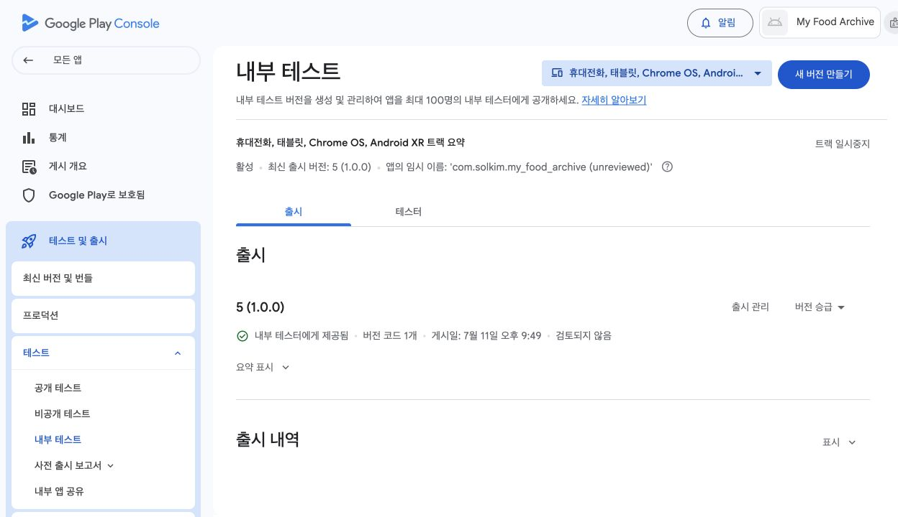

### 7.1 Play App Signing 안내 확인

처음 Android App Bundle을 올릴 때 Play App Signing 안내가 나올 수 있습니다. 기본값을 따르는 편이 가장 단순합니다.

Google Play가 사용자에게 배포되는 앱 서명을 관리하고, 우리는 업로드 키로 앱 번들을 올리는 구조입니다.

> 앱 서명 화면에서 말하는 키가 여러 개라 헷갈릴 수 있습니다.
>
> - **앱 서명 키**: Google Play가 사용자에게 배포할 앱에 쓰는 키입니다.
> - **업로드 키**: 우리가 Play Console에 앱 번들을 올릴 때 쓰는 키입니다.
>
> 처음에는 이 둘을 구분하는 것만으로 충분합니다.

업로드가 끝난 뒤 App Bundle 탐색기의 **다운로드** 탭에서 **서명됨, 범용 APK**를 확인할 수 있습니다. Google Play가 사용자에게 전달할 APK에 서명을 적용한 결과입니다.

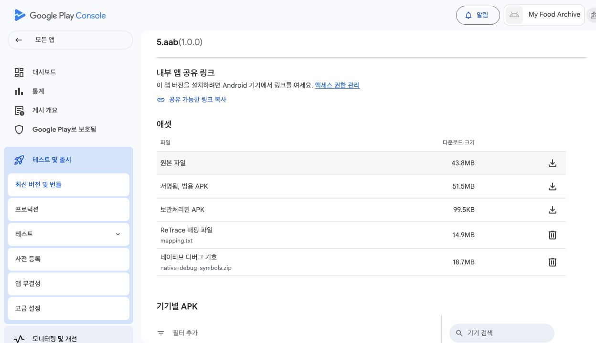

### 7.2 `.aab` 파일 업로드

앱 번들 업로드 영역에 5절에서 만든 `.aab` 파일을 올립니다.

```
build/app/outputs/bundle/release/app-release.aab
```

이 깊은 폴더를 직접 찾아 들어갈 필요는 없습니다. 클로드 코드에게 부탁하면 파일이 있는 폴더 창을 바로 열어 줍니다.

```text
방금 빌드한 .aab 파일이 있는 폴더를 Finder(macOS) 또는 파일 탐색기(Windows)로 열어줘.
```

열린 창에서 `app-release.aab` 파일을 Play Console의 업로드 영역으로 끌어다 놓습니다. 업로드가 끝나면 **최신 버전 및 번들**에서 등록된 버전을 확인합니다.

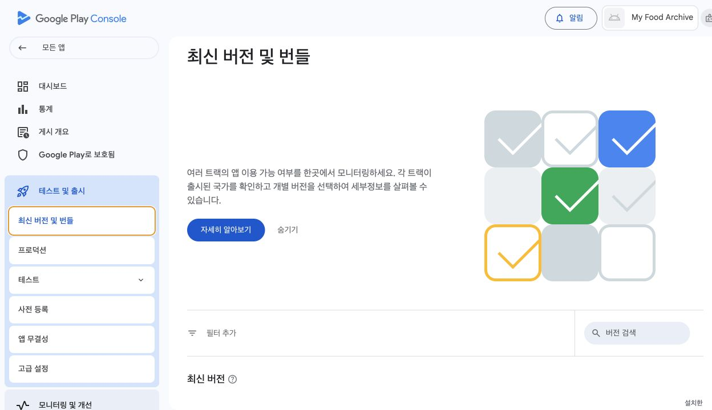

등록된 App Bundle을 열면 버전, 설치 크기, 지원 기기 같은 세부정보가 표시됩니다.

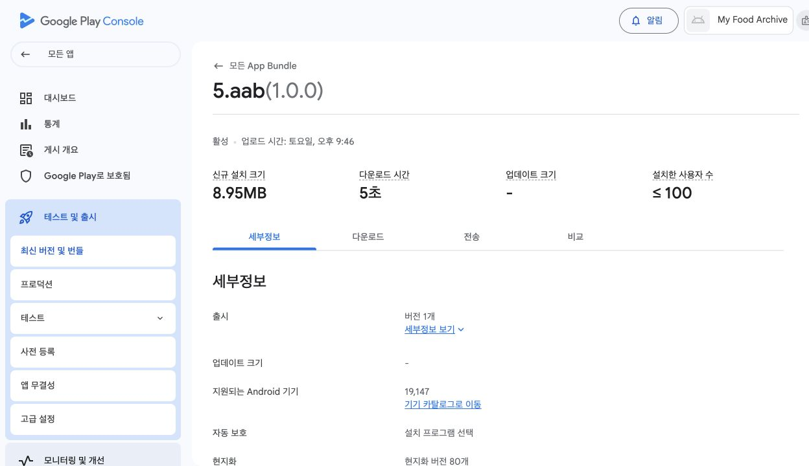

업로드 뒤 오류나 경고가 나올 수 있습니다.

오류는 해결해야 다음으로 갈 수 있습니다. 경고는 지금 넘어갈 수 있는 것과 넘어갈 수 없는 것이 섞여 있습니다. 화면 문장을 복사하거나 캡처해 클로드 코드에게 보여 줍니다.

```text
Google Play Console에 Android App Bundle을 올렸는데 이 경고/오류가 나왔어.
첨부한 스크린샷을 보고, 지금 반드시 고쳐야 하는 것과 나중에 해도 되는 것을 나눠서 알려줘.
```

자주 만나는 문제는 아래와 같습니다.

| 메시지 유형 | 뜻 | 대응 |
|---|---|---|
| 디버그 모드로 서명됨 | Flutter 새 프로젝트의 기본 상태입니다. 업로드용 서명 설정이 아직 안 된 것입니다. | 5절의 프롬프트로 업로드 키 생성과 서명 설정을 다시 진행하고 재빌드합니다. |
| versionCode가 이미 사용됨 | 같은 빌드 번호를 다시 올렸습니다. | `pubspec.yaml`의 `+숫자`를 올리고 다시 빌드합니다. |
| 패키지 이름이 다름 | Play Console 앱과 빌드 파일의 앱 ID가 다릅니다. | `applicationId`를 확인합니다. 한번 올린 패키지 이름은 신중히 다뤄야 합니다. |
| 서명 문제 | 업로드 키 또는 release signing 설정이 맞지 않습니다. | 클로드 코드에게 서명 설정을 다시 점검하게 합니다. |
| 대상 API 수준 경고 | Google Play 요구 target SDK보다 낮을 수 있습니다. | 2026년 7월 12일 기준 새 앱/업데이트는 Android 15, API 35 이상을 target해야 합니다. 공식 요구사항을 다시 확인하고 Android 빌드 설정을 올립니다. |

### 7.3 출시 노트 작성

내부 테스트에도 출시 노트를 적는 칸이 있습니다. 짧게 적습니다.

**내부 테스트 출시 노트 예시**

```text
첫 내부 테스트 버전입니다.

- 음식 사진을 골라 맛집 기록을 저장할 수 있습니다.
- 사진에서 날짜, 지역, 메뉴, 카테고리를 자동으로 채웁니다.
- 저장한 기록을 검색하고 삭제할 수 있습니다.
```

### 7.4 검토 후 내부 테스트로 출시

업로드가 끝나면 **검토** 또는 **버전 검토** 화면으로 넘어갑니다. 큰 문제가 없으면 내부 테스트 트랙에 출시합니다.

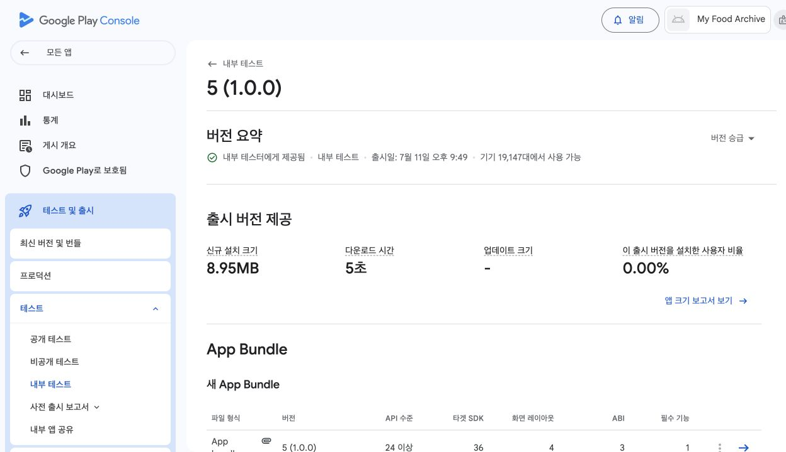

내부 테스트에 출시했다고 해서 바로 모든 사람이 받을 수 있는 것은 아닙니다. 테스터 목록과 참여 링크가 필요합니다.

처음 앱을 내부 테스트에 올린 직후에는 Google Play에 임시 앱 이름이나 임시 스토어 정보가 보일 수 있습니다. 공식 안내 기준으로 첫 설정 정보가 반영되기까지 시간이 걸릴 수 있습니다. 앱이 잘못 올라간 것이 아니라 내부 테스트용 임시 상태일 수 있습니다.

---

## 8. 테스터 목록 만들고 참여 링크 받기

내부 테스트 화면에는 **테스터** 또는 **테스터 관리** 영역이 있습니다.

처음에는 이메일 목록을 하나 만듭니다. 예를 들어 `첫 내부 테스트`처럼 이름을 붙입니다. 여기에 본인이 쓰는 Google 계정 이메일을 넣습니다.

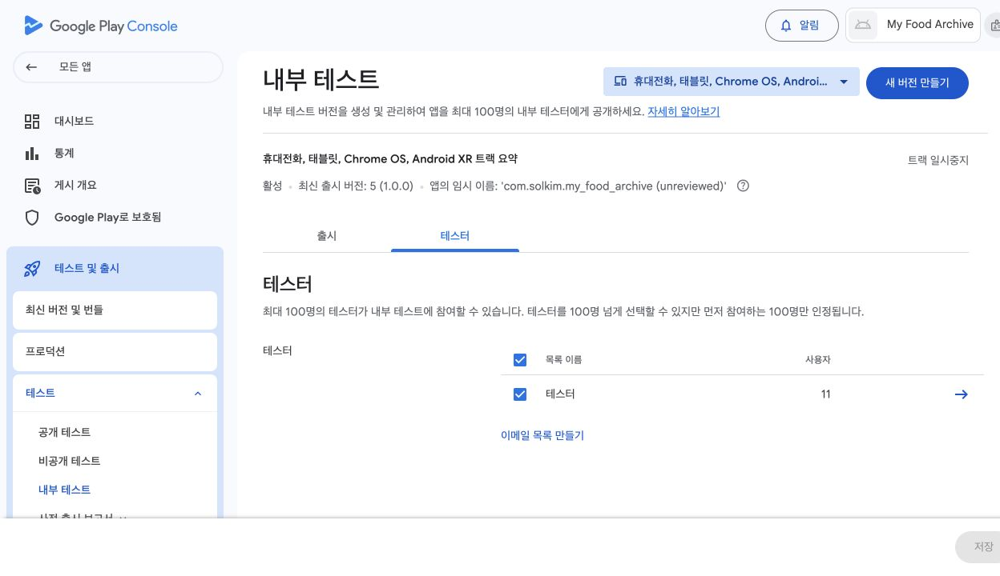

본인 이메일을 넣는 이유는 단순합니다. 다른 사람에게 보내기 전에 내 Android 기기에 먼저 설치해 봐야 하기 때문입니다.

테스터 목록에는 피드백을 받을 이메일 주소나 URL도 넣을 수 있습니다. 이 주소는 테스터 참여 화면에 표시됩니다. 처음에는 본인이 확인할 수 있는 이메일 주소를 넣으면 충분합니다.

테스터 목록을 저장하면 **참여 링크**가 표시됩니다. 화면에 따라 **opt-in 링크**라고 보일 수도 있습니다. opt-in은 테스트에 참여하겠다고 신청해 둔 상태라는 뜻입니다. 이 링크를 복사합니다.

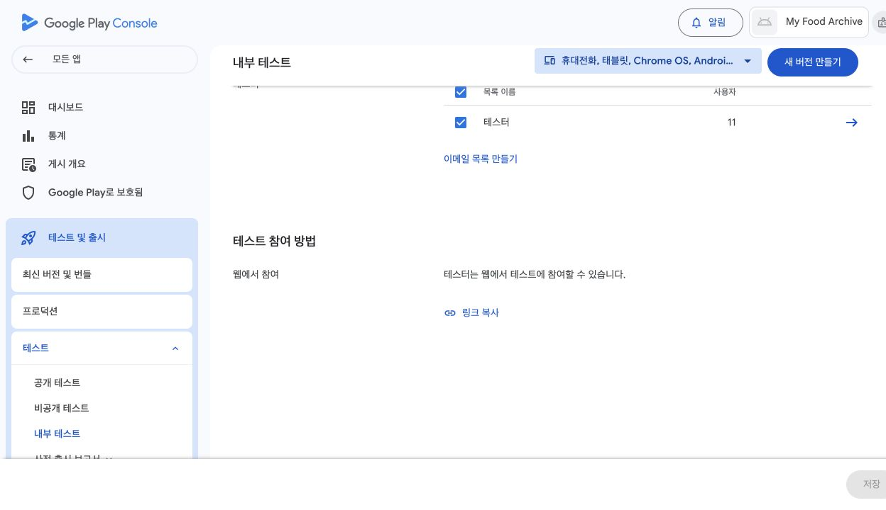

> 테스터는 반드시 목록에 들어간 Google 계정으로 링크를 열어야 합니다.
>
> 휴대폰에 여러 Google 계정이 로그인되어 있으면 다른 계정으로 열려서 "앱을 사용할 수 없음"처럼 보일 수 있습니다. 이때는 Play Store 앱의 계정 아이콘을 눌러 테스터로 등록한 계정으로 바꿉니다.
>
> 참여 링크는 앱이 초안 상태일 때는 제대로 열리지 않을 수 있습니다. 내부 테스트 버전이 게시된 뒤 링크를 공유합니다. 처음 게시한 뒤에는 링크가 테스터에게 보이기까지 시간이 걸릴 수 있습니다.

---

## 9. 실제 Android 기기에 설치하기

이제 실제 Android 기기에서 내부 테스트 참여 링크를 엽니다.

흐름은 보통 이렇습니다.

1. 참여 링크를 엽니다.
2. "테스터로 참여"를 누릅니다.
3. Google Play 앱으로 이동합니다.
4. 앱 설치 버튼을 누릅니다.
5. 설치된 앱을 열어 사진 한 장을 저장해 봅니다.

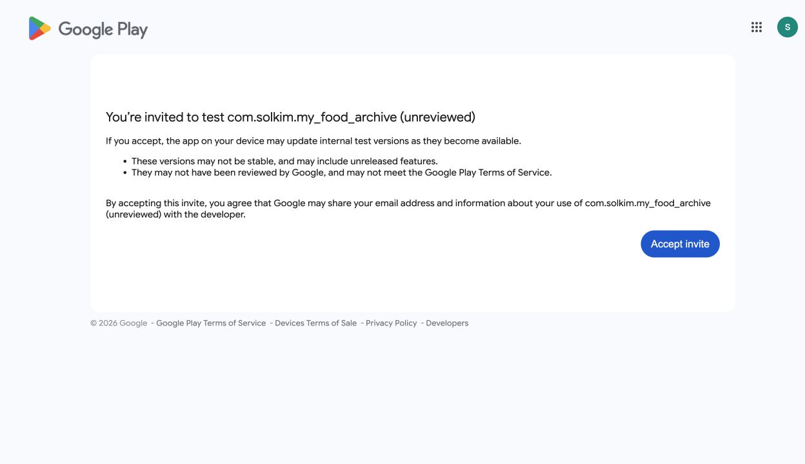

처음에는 바로 보이지 않을 수 있습니다. 내부 테스트 버전을 출시한 직후라면 몇 분에서 몇 시간이 걸릴 수 있습니다. 첫 앱의 첫 출시라면 자동 확인과 반영 지연 때문에 더 오래 걸릴 수도 있습니다. 경우에 따라 최대 48시간 정도 기다려야 할 수 있으니, 링크가 계속 열리지 않는다면 당일에 무리해서 반복하지 말고 다음 날 다시 확인합니다.

막히면 아래를 확인합니다.

| 증상 | 확인할 것 |
|---|---|
| 링크를 열었는데 앱이 없다고 나옴 | 휴대폰의 Google Play 계정이 테스터 이메일과 같은지 확인합니다. |
| 참여는 했는데 설치 버튼이 없음 | 내부 테스트 버전이 실제로 출시되었는지 확인합니다. 초안 상태면 설치할 수 없습니다. |
| 업데이트가 안 보임 | versionCode를 올려 새 버전을 올렸는지 확인합니다. |
| 설치 후 앱이 바로 꺼짐 | 휴대폰에서 오류 화면을 캡처하고, 클로드 코드에게 로그 확인을 부탁합니다. |
| 설치와 실행은 되는데 사진의 AI 자동 입력만 안 됨 | 먼저 Wi-Fi나 데이터 연결을 확인합니다. 연결에 문제가 없으면 사진을 고른 뒤 나오는 화면이나 오류 문구를 캡처하고, 클로드 코드에게 Firebase 설정과 로그를 함께 점검하게 합니다. |

```text
Google Play 내부 테스트 링크로 앱을 설치했는데 실행하자마자 꺼져.
Android 기기에서 원인을 확인할 수 있게 로그를 보는 방법부터 안내해줘.
내가 직접 해야 하는 클릭과 네가 터미널에서 할 수 있는 일을 나눠서 알려줘.
```

### 9.1 수정한 앱을 다시 내부 테스트에 올리는 절차

> 이 절은 16장을 진행할 때 사용합니다. 지금 15장을 따라 처음 읽는 중이라면 건너뛰고 10절로 가면 됩니다.

16장에서 첫 불편을 고친 뒤에는 수정한 앱을 다시 내부 테스트에 올립니다. 처음 올릴 때와 같은 흐름이지만, 두 가지가 다릅니다. `versionCode`를 올려야 하고, 테스터 목록은 다시 만들 필요가 없습니다.

1. 클로드 코드에게 `pubspec.yaml`의 `version` 값에서 `+숫자`를 하나 올리게 합니다. 예: `1.0.0+1` → `1.0.0+2`
2. 새 `.aab` 파일을 빌드합니다.
3. Play Console의 내부 테스트에서 **새 버전 만들기**를 누르고 새 `.aab`를 올립니다.
4. 출시 노트에 무엇이 바뀌었는지 한두 줄 적고 게시합니다.
5. Android 기기의 Google Play에서 앱 페이지를 열면 업데이트 버튼이 보입니다. 반영까지 시간이 걸릴 수 있습니다.

```text
16장에서 고친 앱을 Google Play 내부 테스트에 다시 올리려고 해.
1. pubspec.yaml의 versionCode를 하나 올려줘.
2. Android App Bundle을 다시 빌드해줘.
3. 빌드가 끝나면 Play Console에 올릴 .aab 파일 경로를 알려줘.
```

업데이트를 설치한 뒤에는 16장의 기준 그대로 실제 폰에서 바뀐 부분을 확인합니다. 새 아이콘, 버튼 위치, 안내 문구처럼 이번에 고친 지점을 하나씩 열어 봅니다. 확인이 끝나면 책 16.5절로 이어 갑니다.

---

## 10. 첫 테스트에서 확인할 것

처음 만든 빌드는 다른 사람에게 보내기 전에 내 Android 기기에서 먼저 확인합니다.

확인할 것은 많지 않습니다.

1. 앱이 설치되는가.
2. 앱이 처음 열리는가.
3. + 버튼을 눌렀을 때 사진 선택 화면이 열리는가.
4. 사진을 한 장 고르면 입력 화면으로 넘어가는가.
5. 날짜, 지역, 메뉴, 카테고리가 채워지는가.
6. 식당명을 입력하고 저장하면 홈 화면에 카드가 생기는가.
7. 검색, 수정, 삭제가 되는가.

Android 13 이상에서는 사진 권한 팝업이 보이지 않고 사진 선택 화면이 바로 열릴 수 있습니다. 정상입니다. Android Photo Picker가 대신 처리하는 흐름입니다.

테스트할 때는 화면을 캡처해 둡니다. 특히 아래 화면은 나중에 Google Play 스토어 등록정보에도 쓸 수 있습니다.

| 캡처 | 용도 |
|---|---|
| 홈 화면 | 스토어 스크린샷 후보 |
| 사진 선택 뒤 입력 화면 | 핵심 기능 설명 |
| 저장된 카드가 보이는 화면 | 앱 결과 확인 |
| 검색 결과 화면 | 검색 기능 설명 |
| 상세 화면 | 기록 보기 기능 설명 |

실제 책용 Android 캡처는 아래처럼 앱 내용과 식당명이 한 흐름으로 이어져야 합니다.

| 화면 | 캡처 |
|---|---|
| 홈 | 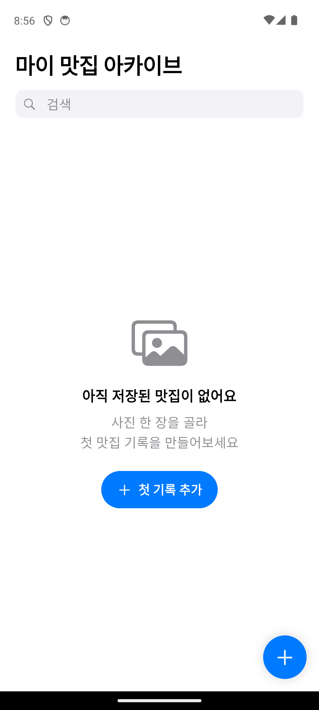 |
| 사진 선택 뒤 입력 | 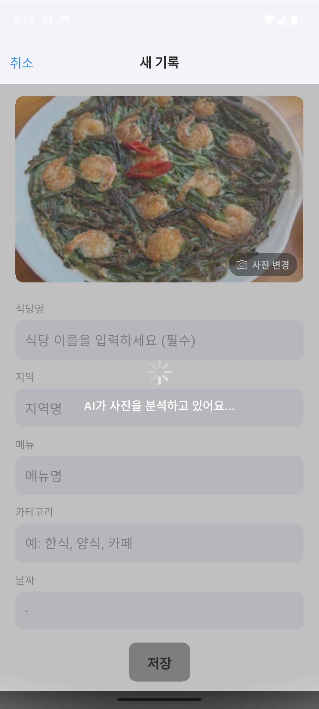 |
| AI 분석 결과 | 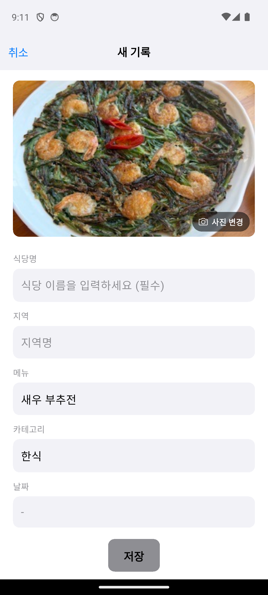 |
| 저장 결과 | 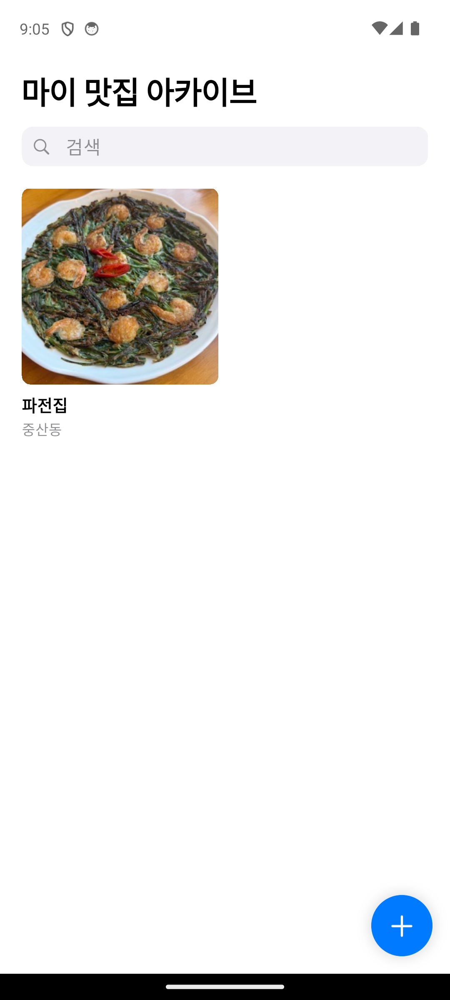 |
| 검색 | 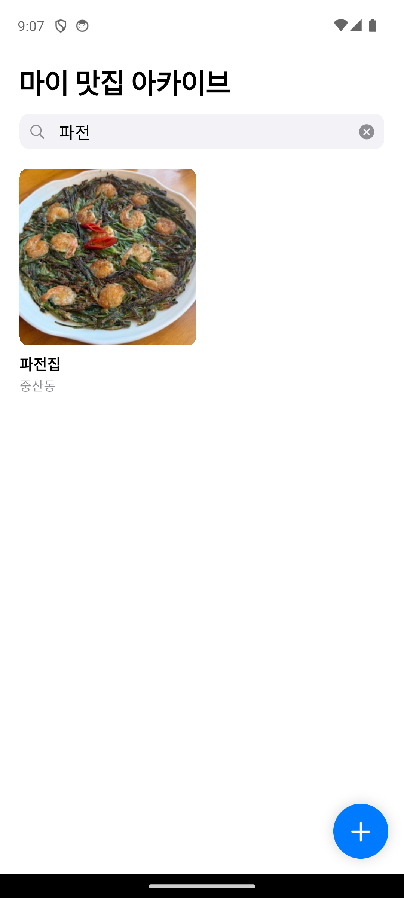 |
| 개인정보처리방침 | 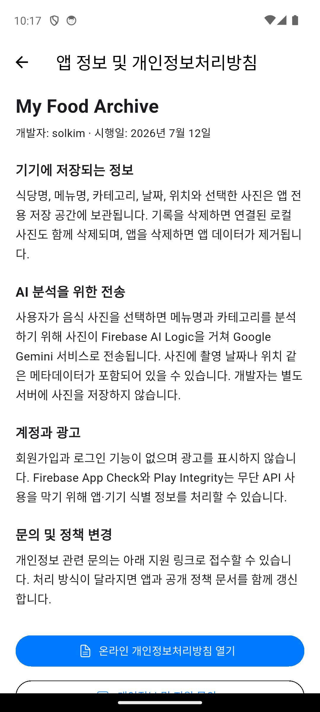 |

---

## 11. 첫 테스터에게 보내는 문장

내 기기에서 한 번 확인했다면 핵심 사용자에 가까운 사람 1~3명에게 보냅니다. 처음부터 많은 사람에게 보내지 않아도 됩니다.

테스터는 개발을 잘 아는 사람보다, 실제로 이 앱의 상황을 겪는 사람이 좋습니다. 마이 맛집 아카이브라면 음식 사진을 자주 찍고 나중에 식당을 다시 찾고 싶어 하는 사람입니다.

**첫 Android 테스터에게 보내는 메시지 예시**

```text
내가 만든 마이 맛집 아카이브 Android 테스트 버전을 Google Play 내부 테스트로 올렸어.
아래 링크를 휴대폰에서 열고, 테스터로 참여한 뒤 설치해 보면 돼.

[내부 테스트 참여 링크]

설치한 뒤 음식 사진 한 장만 저장해 봐 줘.
해 보고 아래 세 가지만 알려줘.

1. 설치나 실행에서 막힌 곳이 있었는지
2. 사진을 저장하는 흐름이 자연스러웠는지
3. 저장한 기록을 다시 찾기 쉬웠는지

막힌 화면이 있으면 캡처해서 보내줘.
```

> 내부 테스트 링크는 지정한 테스터 계정에서만 열립니다.
>
> 상대가 "링크가 안 열린다"고 하면 먼저 Google Play에 로그인된 계정이 초대받은 이메일과 같은지 확인합니다.

다만 지금 바로 보낼지, 내 폰 확인만 마치고 정식 공개 뒤에 보여 줄지는 따로 정할 문제입니다. 누구에게 먼저 보여 줄지 고르는 기준은 책 15.5절에 있습니다. 이 절의 메시지 예시는 보내기로 정했을 때 꺼내 쓰면 됩니다.

**여기까지가 책 15장의 Android 실습입니다. 책 15.5절로 돌아가세요.**

12절부터는 정식 공개를 준비하는 흐름입니다. 16장에서 아이콘과 첫인상을 다듬은 뒤에 진행하는 편이 좋습니다. 비공개 테스트 14일은 한번 시작하면 유지해야 하는 시계라서, 보여 줄 준비가 된 앱으로 시작하는 편이 안전합니다.

---

## 12. 비공개 테스트 12명/14일을 준비하기

> 책 17~18장을 진행할 때는 실제 작업 순서로 다시 정리한 [`release-roadmap.md`](release-roadmap.md)를 우선 사용합니다. 아래 12~13절은 테스터 모집 문구와 세부 설명이 더 필요할 때 찾아보는 참고 자료입니다.

내부 테스트에 성공했다고 해서 바로 Google Play에 공개되는 것은 아닙니다.

저는 배포 전체에서 이 단계가 가장 막막했습니다. 앱은 이미 완성됐는데, 이제부터는 코드가 아니라 사람이 필요하기 때문입니다. 미리 알고 시작하면 덜 막막합니다.

Google Play에는 여러 테스트 트랙이 있습니다.

| 트랙 | 용도 |
|---|---|
| 내부 테스트 | 가장 작은 테스트. 본인과 소수 테스터가 빠르게 설치 확인 |
| 비공개 테스트 | 더 넓은 테스트. 정식 공개 전 사용자 검증 |
| 공개 테스트 | 누구나 테스트 참여 가능 |
| 프로덕션 | Google Play에 정식 공개 |

2023년 11월 13일 이후 만든 개인 개발자 계정이라면, 정식 공개 전에 비공개 테스트를 거쳐야 합니다. 프로덕션 접근 신청 시점에 최소 12명의 테스터가 최근 14일 동안 연속으로 비공개 테스트에 opt-in되어 있어야 합니다. 조직 계정이나 이미 조건이 다른 계정은 Play Console 화면에 표시되는 안내를 우선합니다.

여기서 한 가지를 조심해야 합니다. 내부 테스트는 앱 설정이 덜 끝난 상태에서도 빠르게 시작할 수 있지만, 비공개 테스트는 앱 설정을 마친 뒤 시작하는 흐름입니다. 비공개 테스트에 들어가기 전에는 13절의 앱 콘텐츠, 스토어 등록정보, 개인정보처리방침 URL, 데이터 안전 항목 작성을 완료해야 합니다. 이 항목들이 채워지지 않으면 비공개 테스트 출시 버튼이 막힐 수 있습니다.

내부 테스트에 참여했던 같은 Google 계정으로 비공개 테스트까지 이어갈 때도 주의합니다. Google 공식 안내 기준으로 내부 테스트에 opt-in된 사용자는 공개 테스트나 비공개 테스트 트랙의 버전을 받지 못할 수 있습니다. 같은 계정을 비공개 테스트에도 쓸 예정이라면 먼저 내부 테스트 참여를 해제한 뒤, 비공개 테스트 참여 링크로 다시 opt-in합니다.

내부 테스트는 내 폰과 소수 테스터로 설치를 확인하는 단계입니다. 비공개 테스트는 정식 공개 전에 Google이 요구하는 더 넓은 테스트 단계입니다. 그래서 순서는 이렇게 잡습니다.

1. 내부 테스트에서 내 기기에 설치한다.
2. 핵심 기능이 한 바퀴 도는지 확인한다.
3. 앱이 바로 꺼지거나 저장이 안 되는 문제를 먼저 고친다.
4. 그다음 비공개 테스트에 들어간다.

이 확인 없이 비공개 테스트나 정식 공개로 가면, 작은 설치 문제 하나가 여러 사람에게 그대로 전달됩니다.

### 12.1 비공개 테스트에서 Google이 보는 것

비공개 테스트는 숫자만 채우는 단계가 아닙니다.

Google 공식 안내에는 새 개인 개발자 계정이 프로덕션 접근을 신청할 때 아래 내용을 설명해야 한다고 되어 있습니다.

- 테스터를 어떻게 모집했는지
- 테스터가 앱의 기능을 실제로 써 봤는지
- 어떤 피드백을 받았는지
- 그 피드백을 바탕으로 무엇을 고쳤는지
- 앱이 정식 공개될 준비가 되었다고 판단한 이유

그러니 12명이 opt-in만 하고 아무것도 하지 않으면 안전하지 않습니다. 14일이 지났더라도 테스트가 충분하지 않다고 판단되면 프로덕션 접근 신청이 거절될 수 있습니다.

**비공개 테스트에서 남겨 둘 기록**

1. 테스터에게 보낸 안내 문장
2. 테스터가 실제로 눌러 볼 체크리스트
3. 받은 피드백 3~5개
4. 그 피드백으로 고친 내용
5. 고친 뒤 새 버전을 올린 날짜

### 12.2 비공개 테스트 트랙 만드는 흐름

내부 테스트와 비공개 테스트는 Play Console에서 다른 트랙입니다. 내부 테스트에 성공했다면 아래 순서로 비공개 테스트를 준비합니다.

1. 13절의 앱 콘텐츠와 스토어 등록정보를 필요한 수준까지 채운다.
2. Play Console에서 **테스트 및 출시 → 테스트 → 비공개 테스트**로 들어간다.
3. 기본 비공개 테스트 트랙을 열거나 새 트랙을 만든다.
4. **테스터** 탭에서 이메일 목록, CSV 파일, 또는 Google Group으로 테스터를 추가한다.
5. 피드백을 받을 이메일 주소나 URL을 입력한다.
6. 새 버전을 만들고 `.aab` 파일을 올린다.
7. 출시 노트를 쓰고 비공개 테스트 트랙으로 게시한다.
8. 비공개 테스트 참여 링크를 복사해 테스터에게 보낸다.

테스터에게는 단순히 링크만 보내지 않습니다. 14일 동안 opt-in 상태를 유지해야 한다는 점, 어떤 기능을 눌러 봐야 하는지, 막힌 화면을 어디로 보내야 하는지를 함께 알려 줍니다.

> 내부 테스트에서 이미 앱을 설치했던 계정은 비공개 테스트 참여 전에 내부 테스트에서 나가야 할 수 있습니다.
>
> 테스터가 "링크는 열리는데 업데이트가 안 보인다"고 하면 먼저 이 점을 확인합니다.

### 12.3 직접 모집하는 방법

가장 안전한 방법은 앱의 실제 사용자에 가까운 사람을 직접 모으는 것입니다.

마이 맛집 아카이브라면 음식 사진을 자주 찍고, 나중에 그 식당을 다시 찾고 싶어 하는 사람입니다. 가족, 친구, 지인 중 Android 폰을 쓰는 사람이 있다면 먼저 부탁합니다.

**비공개 테스트 모집 문구 예시**

```text
Android 폰 쓰는 분 중에 음식 사진 자주 찍는 분 계실까요?

제가 만든 마이 맛집 아카이브 Android 앱을 Google Play 비공개 테스트로 올리려고 합니다.
테스터로 참여하면 14일 동안 앱을 설치한 상태로 두고, 중간에 음식 사진 한 장만 저장해 보면 됩니다.

제가 확인하고 싶은 건 세 가지입니다.

1. 설치가 막히지 않는지
2. 사진 저장 흐름이 자연스러운지
3. 저장한 맛집을 나중에 다시 찾을 수 있는지

참여 가능하시면 Google Play에 쓰는 Gmail 주소를 보내 주세요.
```

이 방식은 피드백 품질이 좋습니다. 대신 12명을 모으는 일이 생각보다 어렵습니다. Android 폰을 쓰는 사람만 모아야 하고, 14일 동안 opt-in 상태를 유지해야 하기 때문입니다.

### 12.4 테스터 모집을 외부에 맡길 때의 확인 기준

외부 모집 서비스를 검토할 수는 있습니다. 다만 이것은 Google이 승인한 "우회로"가 아닙니다. 목적은 12명이라는 숫자를 사는 것이 아니라, 실제 Android 사용자에게 앱을 써 보게 하고 피드백과 수정 기록을 남기는 것입니다.

이건 "앱을 대신 만들어 주는" 서비스가 아닙니다. 이미 Play Console에 비공개 테스트 버전이 올라가 있어야 하고, 테스터들이 공식 비공개 테스트 링크로 참여해 14일 동안 앱을 설치하고 실행해 주는 방식입니다.

검색해 보면 Google Play 비공개 테스트 테스터 모집을 내세우는 상품들이 있습니다. 이 책은 특정 서비스를 추천하지 않습니다. 중요한 것은 어디에서 결제하느냐가 아니라, 실제 테스트가 Google Play 요구사항에 맞게 진행되는지입니다.

현재 Google 공식 최소 기준은 12명/14일입니다. 그런데 서비스 상품은 20명이나 25명처럼 더 넉넉한 인원을 내세우기도 합니다. 중간 이탈을 대비하거나 상품을 차별화하기 위한 표현일 수 있습니다. "20명"이라고 쓰여 있다고 해서 Google 공식 기준이 20명이라는 뜻은 아닙니다.

가격과 조건은 계속 바뀝니다. 상담형, 테스터 모집형, 전체 대행형처럼 범위가 나뉘기도 하고, 기기당 과금이나 12명 묶음 과금처럼 계산 방식이 다르기도 합니다. 실제 결제 전에는 최신 상품 페이지, 리뷰, 환불 조건을 확인하세요.

이 방식의 장점은 분명합니다.

- 지인 12명을 직접 설득하지 않아도 된다.
- Android 기기를 가진 테스터를 빠르게 모을 수 있다.
- 14일 동안 이탈 여부를 관리해 주는 경우가 있다.
- 일부 서비스는 설치 증빙, 진행 대시보드, 간단한 피드백을 제공한다.

하지만 리스크도 있습니다.

- 테스터가 실제로 앱을 충분히 써 보지 않으면 프로덕션 접근 신청에서 약점이 될 수 있다.
- "무조건 통과", "승인 보장" 같은 표현은 광고 문구일 뿐, Google 승인까지 보장한다고 믿으면 안 된다.
- Play Console 권한을 통째로 넘기는 전체 대행은 계정 보안 위험이 크다.
- 별점, 공개 리뷰, 설치 수 조작을 함께 요구하면 Google Play 정책 위반 위험이 있다.
- 보상을 대가로 기계적인 설치나 실행만 반복하는 테스터 팜은 개발자 계정에 위험할 수 있다.

#### 외부 모집 서비스를 써도 되는 선

돈을 주고 맡길 수 있는 것은 실제 테스트 업무입니다.
돈을 주고 사면 안 되는 것은 별점, 공개 리뷰, 설치 수, 또는 사용하지 않은 테스트 이력입니다.

Google Play 정책은 앱의 평점, 리뷰, 설치 수를 부정한 방식으로 부풀리는 행위를 금지합니다. 비공개 테스트를 맡기더라도 "5점 리뷰를 남겨 주세요", "설치 수를 올려 주세요", "좋은 리뷰를 써 주세요" 같은 요구는 하지 않습니다.

테스터 모집을 외부에 맡기는 목적은 숫자를 꾸미는 것이 아닙니다. 실제 Android 기기에서 사람이 앱을 열어 보고, 핵심 기능을 눌러 보고, 막힌 지점을 알려 주게 하는 것입니다.

요구할 것은 이것뿐입니다.

1. 공식 비공개 테스트 링크로 opt-in
2. 실제 Android 기기에서 설치
3. 14일 동안 opt-in 유지
4. 앱 핵심 기능 실행
5. 막힌 화면이나 피드백 전달

> 이 절의 핵심은 "쉽게 통과하는 꼼수"가 아닙니다.
> 초보자가 지인 12명을 모으지 못해 멈추지 않도록, 실제 테스트 인력을 외주로 구하는 방법을 알려 주는 것입니다.
>
> 그러니 프로덕션 접근 신청서에도 사실대로 씁니다. 외부 모집 테스터를 썼다면 "외부 모집 테스터와 직접 모집한 사용자를 함께 사용했다"고 적고, 실제로 받은 피드백과 수정 내역을 중심으로 설명합니다. 테스트하지 않은 내용을 테스트했다고 쓰거나, 설치만 시켜 놓고 충분히 사용한 것처럼 쓰면 안 됩니다.

### 12.5 의뢰하기 전에 확인할 질문

테스터 모집 서비스를 쓸 때는 결제 전에 아래를 물어봅니다.

- 실제 Android 기기에서 사람이 직접 테스트하나요, 에뮬레이터나 자동화인가요?
- 테스터 수는 최소 몇 명인가요? 12명보다 여유 있게 넣어 주나요?
- 14일 동안 opt-in 상태를 유지하는지 확인해 주나요?
- 테스터가 앱을 실행했다는 증빙을 주나요?
- 피드백이나 오류 화면 캡처를 받을 수 있나요?
- 프로덕션 접근 신청에 필요한 테스트 요약 작성도 도와주나요?
- 실패하거나 테스터가 이탈하면 무료 연장 또는 환불이 되나요?
- Play Console 권한을 요구하나요, 아니면 테스트 링크와 이메일 목록만으로 진행하나요?

가장 안전한 방식은 **Play Console 권한을 넘기지 않는 것**입니다. 개발자는 비공개 테스트 트랙을 직접 만들고, 서비스 제공자는 테스터 이메일 목록과 테스트 참여만 돕습니다. 꼭 권한을 줘야 한다면 소유자 권한이 아니라 필요한 범위의 권한만 부여하고, 작업이 끝난 뒤 바로 회수합니다.

```text
Google Play 비공개 테스트 대행 서비스를 쓰려고 해.
아래 서비스 설명을 보고 위험한 조건이 있는지 확인해줘.

특히 봐야 할 것:
1. Play Console 권한을 요구하는지
2. 실제 기기 테스트인지
3. 14일 opt-in 유지 증빙이 있는지
4. 리뷰나 별점 조작을 요구하는지
5. 실패 시 재진행/환불 조건이 있는지
6. 무조건 승인 보장처럼 Google 심사를 대신 보장하는 표현이 있는지

[여기에 서비스 설명 붙여넣기]
```

### 12.6 비공개 테스트 후 프로덕션 접근 신청 준비

14일을 채우면 바로 "끝"이 아닙니다. Play Console 대시보드에서 프로덕션 접근을 신청해야 합니다.

이때 Google은 테스트 과정과 앱 준비 상태를 묻습니다. 미리 아래처럼 정리해 둡니다.

**프로덕션 접근 신청용 메모 예시**

```text
- 테스터 모집: 음식 사진을 자주 찍는 Android 사용자와 외부 모집 테스터를 함께 사용
- 테스트 기간: 2026년 6월 1일~6월 15일
- 테스트 인원: 15명 opt-in, 14일 유지
- 테스트한 기능: 사진 선택, 자동 입력, 저장, 검색, 수정, 삭제
- 받은 피드백: 설치 링크 계정 혼동 1건, 저장 버튼 위치 불편 1건, 검색어 안내 부족 1건
- 반영한 수정: 설치 안내 문구 보강, 저장 버튼 여백 조정, 빈 검색 결과 안내 문구 추가
- 정식 공개 판단: 핵심 기능이 실제 기기에서 한 바퀴 동작했고, 반복 크래시가 없었음
```

외부 모집 서비스를 썼더라도 이 메모는 직접 갖고 있어야 합니다. 프로덕션 접근 신청은 "테스터 수를 채웠다"보다 "무엇을 테스트했고 무엇을 고쳤다"를 설명하는 단계에 가깝습니다.

신청 화면의 답변 문장도 클로드 코드에게 초안을 맡길 수 있습니다.

```text
Google Play 프로덕션 접근 신청 답변을 준비하려고 해.
아래 기록을 바탕으로 신청 화면에 넣을 답변 초안을 만들어줘.

1. 비공개 테스트 기간:
2. 테스터 수와 모집 방법:
3. 받은 피드백:
4. 반영한 수정:
5. 정식 공개가 준비되었다고 판단한 이유:

과장하지 말고, 실제로 테스트한 내용만으로 작성해줘.
```

특히 테스터 수는 12명에 딱 맞추기보다 15명 이상으로 여유를 두는 편이 안전합니다. 중간에 한 명이 opt-in을 해제하거나 계정 문제가 생기면 14일 연속 조건이 깨질 수 있기 때문입니다.

---

## 13. 비공개 테스트와 정식 공개 전에 반드시 채울 항목

내부 테스트까지만 진행 중이라면 13절은 건너뜁니다. 비공개 테스트와 정식 공개의 실제 실행 순서는 [`release-roadmap.md`](release-roadmap.md)를 따르고, 여기서는 각 항목의 상세 설명만 참고합니다.

Play Console 대시보드에는 **앱 콘텐츠**와 **스토어 등록정보** 관련 작업이 있습니다.

### 13.1 앱 콘텐츠

대표적으로 아래 항목이 나옵니다.

| 항목 | 마이 맛집 아카이브에서 볼 점 |
|---|---|
| 개인정보처리방침 | 사진을 외부 AI에 보내는 흐름이 있으므로 준비해야 합니다. |
| 앱 액세스 | 로그인 없이 쓰는 앱이면 로그인 정보가 없다고 표시합니다. |
| 광고 | 광고가 없으면 없다고 답합니다. |
| 콘텐츠 등급 | 설문에 답해 등급을 받습니다. 음식 사진 기록 앱 기준으로 차분히 답합니다. |
| 타겟층 | 어린이를 대상으로 만든 앱이 아니라면 그렇게 답합니다. |
| 데이터 안전 | 사진, 위치 정보처럼 앱이 처리하는 데이터를 실제 동작 기준으로 답합니다. |

콘텐츠 등급과 데이터 안전은 설문 형식입니다. 질문이 낯설어도 혼자 추측하며 답하지 않아도 됩니다. 화면의 질문을 복사해 클로드 코드에게 넘기면, 프로젝트 코드를 읽고 실제 동작 기준으로 답을 정리해 줍니다.

```text
Google Play 앱 콘텐츠의 [콘텐츠 등급 / 데이터 안전] 설문을 작성 중이야.
아래 질문에 어떻게 답해야 하는지, 이 프로젝트의 실제 동작 기준으로 알려줘.

규칙:
1. 코드에서 확인되는 사실만 근거로 답해줘.
2. 확신이 없는 항목은 추측하지 말고 "직접 확인 필요"라고 표시해줘.
3. 각 답의 근거를 한 줄씩 붙여줘.

[여기에 설문 질문 붙여넣기]
```

#### 개인정보처리방침 만들기

Play Console에 입력할 개인정보처리방침은 로그인 없이 열리는 공개 URL로 준비합니다. 클로드 코드에게 실제 앱 동작을 바탕으로 초안을 부탁하고, Notion 같은 공개 페이지에 올린 뒤 그 주소를 Play Console의 앱 콘텐츠에 있는 개인정보처리방침 칸에 넣습니다.

```text
마이 맛집 아카이브 Android 앱의 개인정보처리방침 초안을 만들어줘.

이 앱의 실제 동작 기준으로 써줘.
1. 맛집 기록과 사진은 사용자 기기 안에 저장된다.
2. 사용자가 고른 음식 사진은 AI 분석을 위해 Firebase AI Logic을 통해 외부 AI 서비스로 전송된다.
3. 회원가입과 로그인은 없다.
4. 광고는 없다.
5. 문의 이메일: [내 이메일]

과장하거나 빠뜨리지 말고, 실제 동작과 다른 내용은 쓰지 마.
```

방침 페이지 하나에 문의 이메일 안내까지 함께 넣어 두면, 지원 주소가 필요한 항목에도 같은 주소를 쓸 수 있습니다.

#### 데이터 안전에서 가장 조심할 점

이 앱은 사용자가 고른 음식 사진을 Firebase AI Logic을 통해 외부 AI에 보냅니다.

따라서 "아무 데이터도 수집하지 않는다"고 단정하면 위험합니다. Google Play의 데이터 안전 답변은 실제 앱 동작과 개인정보처리방침을 기준으로 작성해야 합니다.

사진을 기기 안에만 저장하는 부분과, AI 분석을 위해 사진을 외부 서비스에 보내는 부분을 구분해서 검토하세요.

내부 테스트 트랙만 사용할 때는 데이터 안전 섹션이 일반 공개 화면에 바로 노출되지 않을 수 있습니다. 하지만 비공개 테스트, 공개 테스트, 프로덕션 공개로 넘어가려면 개인정보처리방침 URL과 데이터 안전 답변을 준비해야 합니다. 수집하는 데이터가 없다고 생각되는 앱도 데이터 안전 양식에서 실제 동작을 기준으로 답해야 합니다.

### 13.2 기본 스토어 등록정보

스토어 등록정보에는 앱을 소개하는 글과 이미지가 들어갑니다.

| 항목 | 준비 예시 |
|---|---|
| 앱 이름 | 마이 맛집 아카이브 |
| 간단한 설명 | 음식 사진 한 장으로 맛집 기록을 저장하고 다시 찾는 앱 |
| 자세한 설명 | 사진 선택, 자동 입력, 검색 흐름을 3~5문단으로 설명 |
| 앱 아이콘 | 512 x 512 PNG |
| 기능 그래픽 | Google Play 상단에 쓰이는 대표 이미지 (1024 x 500) |
| 휴대전화 스크린샷 | 앱 실제 화면 캡처 2장 이상 |

앱 아이콘과 기능 그래픽은 디자인 도구를 배우지 않아도 됩니다. 16장에서 앱 아이콘을 만들 때처럼, AI 이미지 생성 도구에 컨셉을 설명하고 몇 가지 안을 받아 고르면 됩니다. 규격에 맞는 크기 조정은 클로드 코드에게 맡길 수 있습니다.

앱을 소개하는 글도 빈칸을 앞에 두고 혼자 쓰지 않아도 됩니다. 클로드 코드에게 초안을 맡기고, 읽어 보며 내 말투로 고치면 됩니다.

```text
Google Play 스토어 등록정보를 작성하려고 해.
이 프로젝트의 실제 기능 기준으로 아래 두 가지 초안을 한국어로 만들어줘.

1. 간단한 설명 (80자 이내 한 문장)
2. 자세한 설명 (3~5문단, 사진 선택 → AI 자동 입력 → 저장 → 검색 흐름 중심)

없는 기능을 만들어 내지 말고, 과장 표현은 쓰지 마.
```

스크린샷은 내부 테스트로 설치한 실제 Android 기기에서 기능을 확인한 뒤 고릅니다. 홈 화면, 입력 화면, 저장 결과, 검색 화면을 차례로 캡처합니다.

### 13.3 정식 공개 전 체크리스트

정식 공개로 넘어가기 전에는 아래를 확인합니다.

- 내부 테스트에서 내 기기 설치 성공
- 핵심 기능 한 바퀴 확인
- 앱 번들 versionCode 증가 규칙 확인
- 개인정보처리방침 URL 준비
- 데이터 안전 답변 작성
- 스토어 등록정보 이미지 준비
- 비공개 테스트 요구사항 확인
- 프로덕션 접근 신청 가능 상태 확인

**여기까지가 17장 상세 참고입니다.** 제출 전 마지막 점검은 책 17.5절의 프롬프트와 [`release-roadmap.md`](release-roadmap.md)의 10절 "마지막 점검"을 함께 사용합니다.

### 13.4 프로덕션 트랙에 출시하기

프로덕션 접근 신청이 승인되면 정식 공개를 진행할 수 있습니다. 처음이라 긴장될 수 있지만, 아래 순서대로 출시 버전을 만들고 검토하면 됩니다.

흐름은 내부 테스트 업로드와 거의 같습니다. 트랙만 프로덕션으로 바뀝니다.

1. Play Console에서 **테스트 및 출시 → 프로덕션**으로 들어갑니다.
2. **새 버전 만들기**를 누릅니다. 비공개 테스트에 올렸던 버전을 그대로 가져오는 승격 화면이 보이면 그쪽이 더 단순합니다. 새 `.aab`를 올린다면 `versionCode`를 올려 다시 빌드합니다.
3. 출시 노트를 쓰고 검토 화면으로 넘어갑니다.
4. 출시 비율을 정하는 단계적 출시 화면이 나오면, 첫 앱은 100%로 두는 편이 단순합니다.
5. 출시를 확정하면 Google 심사가 시작됩니다. 몇 시간에서 며칠까지 걸릴 수 있습니다.

심사가 통과되면 Google Play에 앱이 공개됩니다. 정식 링크는 아래 형태입니다.

```
https://play.google.com/store/apps/details?id=[내 패키지 이름]
```

이 링크가 실제 Android폰에서 열리는지 확인했다면, 책 18.4절로 돌아가 첫 사용자에게 보냅니다.

심사에서 수정 요청을 받아도 실패한 것이 아닙니다. 수정 요청 내용을 복사해 클로드 코드에게 원인과 수정 위치를 분류시키고, 고쳐서 다시 올리면 됩니다.

> 아직 프로덕션 접근 승인 전이라면, 책 18.4절의 첫 사용자 확인은 비공개 테스트 링크로 먼저 진행해도 됩니다. 정식 링크가 열린 뒤에 바꿔 보내면 됩니다.

---

## 14. 공식 문서 확인 목록

이 자료는 아래 공식 문서를 기준으로 작성했습니다.

- Google Play Console 개발자 계정 만들기: https://support.google.com/googleplay/android-developer/answer/6112435
- Google Play Console 앱 만들기와 설정: https://support.google.com/googleplay/android-developer/answer/9859152
- 내부/비공개/공개 테스트 설정: https://support.google.com/googleplay/android-developer/answer/9845334
- 새 개인 개발자 계정의 테스트 요구사항: https://support.google.com/googleplay/android-developer/answer/14151465
- 사용자 평점, 리뷰, 설치 수 정책: https://support.google.com/googleplay/android-developer/answer/9898684
- 앱 서명과 Play App Signing: https://developer.android.com/studio/publish/app-signing
- Flutter Android 배포: https://docs.flutter.dev/deployment/android
- Google Play Target API 요구사항: https://support.google.com/googleplay/android-developer/answer/11926878
- 사진 및 동영상 권한 정책: https://support.google.com/googleplay/android-developer/answer/15800983
- 데이터 안전 양식: https://support.google.com/googleplay/android-developer/answer/10787469
- Firebase AI Logic App Check: https://firebase.google.com/docs/ai-logic/app-check
- 사용자 데이터와 개인정보처리방침: https://support.google.com/googleplay/android-developer/answer/10144311
- 앱 콘텐츠와 앱 검토 준비: https://support.google.com/googleplay/android-developer/answer/9859455
- Google Play 스토어 등록정보와 미리보기 애셋: https://support.google.com/googleplay/android-developer/answer/1078870

진행 전에 특히 아래 네 가지는 최신 기준을 다시 확인하세요.

- Google Play 개발자 계정 등록비
- 새 개인 개발자 계정의 비공개 테스트 요구사항
- Google Play target API level 요구사항
- Play Console 메뉴 이름과 스토어 등록정보 이미지 규격
