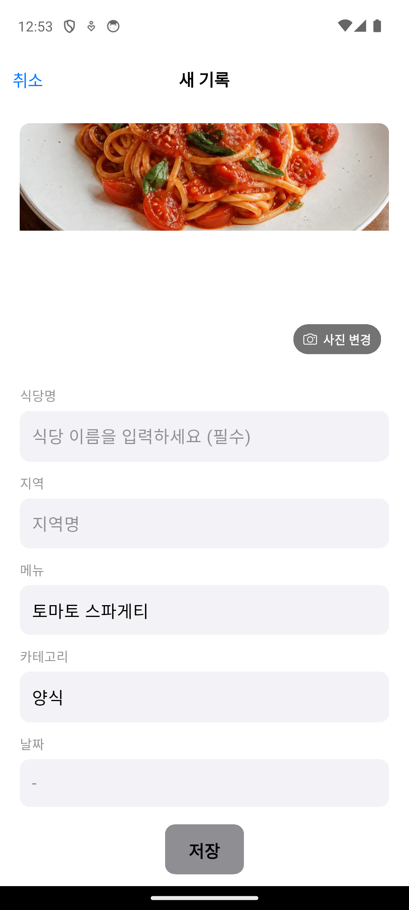

# Android 앱을 Google Play 내부 테스트에 올리기

Android 앱 개발과 Google Play 배포가 처음이라면 1절부터 순서대로 진행합니다.

이 문서는 책 15~16장에서 사용합니다.

| 지금 읽는 곳 | 온라인 자료를 여는 시점과 범위 | 책으로 돌아갈 곳 |
|---|---|---|
| 책 15장 | 1~11절. 9.1절은 건너뜀 | 책 15.5절로 돌아가기 |
| 책 16장 | 책 16.4절까지 앱을 수정한 뒤 9.1절 진행. 가까운 사람에게 보낼 경우 11절의 메시지만 사용 | 책 16.5절로 돌아가기 |

계정 확인을 기다려야 하면 창을 닫고, 확인 완료 메일이나 완료 상태가 표시된 뒤 5절부터 다시 시작합니다. 내부 테스트 버전의 반영을 기다릴 때 참여 링크를 아직 만들지 않았다면 8절부터, 이미 만들었다면 9절부터 다시 시작합니다. 17장부터는 [Android 공개 가이드](release-roadmap.md)로 이동합니다.

> 기준일: 2026년 7월 12일
> Google Play Console 화면 이름과 요구사항은 바뀔 수 있습니다. 실제 진행 전에는 Play Console에 표시되는 최신 안내를 우선합니다.

---

## 1. 처음 보는 Google Play 용어

시작하기 전에 이 자료에서 반복해서 사용하는 말만 짧게 알아둡니다.

| 용어 | 뜻 |
|---|---|
| Google Play Console | 앱을 등록하고 테스트·공개 상태를 관리하는 웹사이트 |
| Android App Bundle(AAB) | Google Play에 업로드하는 Android 배포 파일. 확장자는 `.aab` |
| 패키지 이름 | Google Play와 Firebase가 앱을 구분하는 고유 ID. 예: `com.example.myapp` |
| 트랙 | 앱을 받을 사람을 나누는 배포 통로 |
| 내부 테스트 | 나와 소수의 지정 테스터가 빠르게 설치하는 첫 테스트 단계 |
| 참여 링크 | 지정한 Google 계정으로 테스트 참여를 선택하고 앱을 설치하는 주소 |
| App Check | 등록된 앱에서 보낸 요청인지 Firebase가 확인하는 보호 기능 |
| Play Integrity | Google Play를 통해 설치된 Android 앱인지 확인할 때 사용하는 App Check 제공자 |
| 앱 서명 인증서 SHA-256 | Google Play가 배포하는 앱 서명을 Firebase에서 구분하는 지문 값 |

Play Console 메뉴는 **테스트 및 출시**, **앱 콘텐츠**, **스토어 등록정보**처럼 역할별로 나뉩니다. 각 절에는 현재 찾아야 할 메뉴와 버튼이 순서대로 나옵니다.

---

## 2. 전체 흐름

이번 절에서는 실제로 누를 순서 일곱 단계를 먼저 정리합니다.

1. Google Play Console 개발자 계정을 준비합니다.
2. Play Console에 새 앱을 만듭니다.
3. 클로드 코드에게 Google Play용 앱 번들 파일을 만들게 합니다.
4. 내부 테스트 트랙에 앱 번들을 올립니다.
5. 테스터 이메일 목록을 만들고 참여 링크를 받습니다.
6. 실제 Android 기기에서 링크를 열고 앱을 설치합니다.
7. 테스터에게 보낼 문장을 준비합니다.

이 온라인 자료의 범위는 내부 테스트로 앱을 내 폰에 설치하고 테스터에게 보낼 문장을 준비하는 것까지입니다. Google Play 개인 개발자 계정의 비공개 테스트 12명/14일 준비는 17장에서 [`release-roadmap.md`](release-roadmap.md)의 6절을 따라 진행합니다.

| Play Console과 기기에서 진행 | 클로드 코드에게 요청 |
|---|---|
| Play Console 개발자 계정 가입 | 프로젝트의 Android 설정 점검 |
| 결제, 본인 확인, 기기 확인 | 패키지 이름과 버전 번호 확인 |
| Play Console에서 앱 만들기 | 업로드 키 생성과 배포용 서명 설정 |
| 내부 테스트 트랙에 파일 업로드 | Android App Bundle 빌드 |
| 테스터 이메일 목록 만들기 | 오류 로그 해석과 수정 |
| 실제 기기에서 설치 확인 | 재빌드와 versionCode 증가 |

결제, 본인 확인과 비밀번호 입력은 화면에서 직접 진행합니다. 프로젝트 설정, 빌드, 파일 찾기와 오류 수정은 클로드 코드에게 요청합니다.

Play Console 화면이 이 자료와 다르면 아래 프롬프트를 사용합니다.

```text
Google Play Console 화면이야.
첨부한 화면을 보고 다음 내용을 알려줘.

1. 지금 어느 단계인지
2. 다음에 눌러야 할 버튼
3. 선택하면 안 되는 항목이 있는지
```

---

## 3. 준비물

진행 전에 아래를 확인합니다.

| 준비물 | 설명 |
|---|---|
| Google 계정 | Play Console 개발자 계정에 사용할 계정입니다. Google 안내 기준으로 Play Console 계정 가입은 만 18세 이상이어야 합니다. |
| 결제 수단 | Google Play 개발자 계정은 일회성 등록비가 있습니다. 공식 안내 기준으로 25달러입니다. 선불카드는 거부될 수 있고, 실제 결제 가능 수단은 가입 화면에서 확인합니다. |
| 실제 Android 기기 | 새 개인 개발자 계정은 정식 공개 전 Play Console 모바일 앱으로 Android 기기 접근 확인이 필요합니다. 내부 테스트 설치 확인에도 실제 기기가 가장 좋습니다. |
| 14장까지 완성한 Android 프로젝트 | 4장에서 만든 기술 설계서와 7장에서 만든 구현계획서를 클로드 코드가 읽을 수 있도록 프로젝트의 `docs` 폴더에 둡니다. |
| 앱 패키지 이름 | 예: `com.solkim.my_food_archive`. 이 예시는 그대로 복사하지 말고, 본인의 영문 이름이나 브랜드를 넣어 고유하게 정합니다. Play Console에 한 번 올라간 패키지 이름은 나중에 바꾸기 어렵습니다. |

#### Windows 사용자

Windows에서 Android 앱을 만들고 있다면 이 자료를 그대로 따라갈 수 있습니다.

Android Studio, Flutter, JDK, Android SDK는 책 6장, 7장, 9장의 Windows/Android 안내에 따라 준비한 상태여야 합니다.

문서의 파일 경로는 책 전체 흐름에 맞춰 `/`로 적지만, Windows 탐색기나 PowerShell에서는 `build\app\outputs\bundle\release\app-release.aab`처럼 `\`로 보일 수 있습니다. 같은 파일입니다.

#### Mac 사용자

Mac에서도 Android Studio와 Google Play Console을 사용해 같은 순서로 진행합니다.

---

## 4. Google Play Console 개발자 계정 만들기

먼저 Google Play Console에 들어갑니다.

[https://play.google.com/console](https://play.google.com/console)

Google 계정으로 로그인하면 개발자 계정 만들기 절차가 시작됩니다. 개인으로 앱을 올릴 예정이라면 개인 개발자 계정을 선택합니다. 회사 이름으로 앱을 올릴 예정이라면 조직 계정을 선택해야 합니다.

가입 과정에서는 이름, 주소, 전화번호, 개발자 이름, 결제 정보 등을 확인합니다. 개발자 이름은 나중에 Google Play에 표시될 수 있으니, 임시 별명처럼 보이지 않게 정합니다.

중간에 앱 경험, 개발 목적, 앱 수 같은 질문이 나올 수 있습니다. 이것은 Google이 계정 상태를 파악하기 위한 질문입니다. 아직 앱이 하나뿐이라면 있는 그대로 답하면 됩니다.

새 개인 개발자 계정은 정식 공개 전 Android 기기 접근 확인이 필요합니다. 이때는 Play Console 모바일 앱을 실제 Android 기기에 설치하고, 개발자 계정으로 로그인해 확인을 마칩니다. 정부 발급 신분증이나 결제 카드처럼 법적 이름과 연결된 정보를 요구할 수도 있습니다. 화면에 표시되는 안내를 기준으로 입력 항목을 하나씩 확인합니다.

본인 확인에는 며칠이 걸릴 수 있습니다.

가입 중 막히는 화면이 나오면 민감정보가 보이지 않는 화면만 원본으로 캡처해 클로드 코드에게 묻습니다. 결제 정보나 주소가 보이는 화면에서는 오류 문구와 버튼 이름만 텍스트로 전달합니다.

```text
Google Play Console 개발자 계정 가입 중인데, 이 화면에서 다음에 무엇을 눌러야 할지 모르겠어.
첨부한 스크린샷을 보고 진행 방법을 알려줘.
```

개발자 계정이 만들어지면 Play Console 홈으로 들어갈 수 있습니다. 이제 새 앱을 등록할 준비가 끝났습니다.


계정 생성이 끝나면 [Android 개발자 인증]에서 등록된 패키지 이름을 확인할 수 있습니다.


---

## 5. Play Console에 새 앱 만들기

이제 Play Console에 앱을 하나 만듭니다.

Play Console 홈에서 [앱 만들기]를 누릅니다.


새 앱 화면에서는 처음에 아래 정보를 입력합니다.

| 항목 | 입력 예시 | 설명 |
|---|---|---|
| 앱 이름 | `My Food Archive` 또는 `마이 맛집 아카이브` | Google Play에 보일 이름입니다. 나중에 바꿀 수 있지만 처음부터 자연스럽게 정합니다. |
| 기본 언어 | 한국어 | 본문과 앱 설명을 한국어로 쓸 예정이면 한국어를 고릅니다. |
| 앱 또는 게임 | 앱 | 게임이 아니므로 앱입니다. |
| 무료 또는 유료 | 무료 | 이 책에서 만드는 앱은 무료로 선택합니다. 무료 앱을 나중에 유료 앱으로 바꾸는 것은 제한될 수 있습니다. |
| 선언 | 개발자 프로그램 정책 동의 | 화면에 표시되는 약관과 정책을 확인합니다. |

앱을 만들면 대시보드가 열립니다.


대시보드에는 해야 할 일이 많이 보일 수 있습니다.

스토어 등록정보, 앱 콘텐츠, 내부 테스트, 앱 서명, 데이터 보안, 콘텐츠 등급 같은 메뉴가 한꺼번에 나오기 때문입니다. 이 자료에서는 먼저 내부 테스트에 필요한 흐름만 사용합니다.

> 패키지 이름은 처음 앱 번들을 올리는 순간 고정됩니다.
>
> 예를 들어 `com.solkim.my_food_archive`로 올리면 나중에 같은 앱을 `com.example.myfood`처럼 바꿔 올릴 수 없습니다. 앱 이름은 바꿀 수 있지만, 패키지 이름은 앱의 주민등록번호에 가깝습니다. 첫 업로드 전에 클로드 코드에게 한 번 더 확인하게 합니다.

---

## 6. 클로드 코드에게 Google Play용 앱 번들을 만들게 하기

Google Play에 올릴 파일은 확장자가 `.aab`인 Android App Bundle입니다. 먼저 이 파일에 들어갈 Android와 Firebase 설정을 확인한 뒤 빌드합니다.

### 6.1 첫 빌드 전에 Android와 Firebase 설정 확인하기

```text
Google Play 내부 테스트용 Android App Bundle을 만들기 전에 필요한 Android와 Firebase 설정을 확인해줘.
네가 고칠 수 있는 것은 직접 고치고, 내가 웹에서 해야 할 일만 알려줘.
```

Firebase Console에서 앱 등록이나 설정 파일 다운로드가 필요하면 클로드 코드가 해당 화면과 순서를 알려 줍니다. 안내된 화면 작업과 코드 수정이 모두 끝난 뒤에 다음 단계로 갑니다. Play App Signing 앱 서명 정보는 첫 AAB를 올린 뒤 7.5절에서 연결합니다.

클로드 코드의 결과에서 아래 네 항목이 완료되었는지 확인합니다. 파일을 직접 열어 검사하지 않고, 빠진 항목은 클로드 코드가 고치거나 필요한 화면을 안내하게 합니다.

| 완료 항목 | 완료 기준 |
|---|---|
| Firebase Android 앱 | 프로젝트의 패키지 이름과 같은 Android 앱이 등록됨 |
| Firebase 설정 파일 | 현재 Android 앱에 맞는 설정 파일이 프로젝트에 연결됨 |
| Google 서비스 연결 | Android 빌드가 Firebase 설정을 읽도록 연결됨 |
| App Check 제공자 | 개발용과 Google Play 배포용 제공자가 각각 설정됨 |

### 6.2 업로드 키와 AAB 만들기

앱을 Google Play에 올릴 때는 업로드 키로 AAB에 서명합니다. 클로드 코드에게 내부 테스트에 올릴 파일을 만들어 달라고 부탁합니다.

```text
Google Play 내부 테스트에 올릴 Android App Bundle을 만들어줘.
네가 할 수 있는 작업은 직접 진행하고, 비밀번호처럼 내가 직접 입력해야 할 때만 알려줘.
```

업로드 키를 새로 만들 때 사람은 전용 **비밀번호**를 정하고 터미널의 숨김 입력란에 직접 입력합니다.

Google 계정 비밀번호를 쓰면 안 됩니다. 이 열쇠 전용의 새 비밀번호를 만드세요. 잊어버리면 재설정 절차를 밟아야 하니, 평소 쓰는 비밀번호 보관 방법에 적어 둡니다.

비밀번호를 채팅에 붙여 넣지 마세요. 코딩 에이전트는 `keytool`을 실행하고 입력 직전에 멈출 수 있습니다. 그때 사용자가 터미널에 직접 입력하거나 비밀번호 관리자를 사용합니다. `key.properties`, 키스토어, 비밀번호는 GitHub에 올리지 않습니다.

**Windows에서 keytool 오류가 날 때**

Windows에서 업로드 키를 만들 때 `keytool` 명령어가 없다는 오류가 나올 수 있습니다.

`keytool`은 보통 Android Studio에 포함되어 있습니다. 클로드 코드에게 위치를 찾아 이어서 실행하게 합니다.

```text
Windows에서 keytool 명령어가 없다는 오류가 나왔어.
필요한 위치를 찾아 업로드 키 생성을 계속 진행해줘.
내가 직접 입력해야 할 때만 알려줘.
```

클로드 코드는 패키지 이름과 버전, 업로드용 서명, Google Play의 현재 Android 요구사항, 민감 파일의 Git 제외 여부를 확인하고 AAB를 만듭니다. 사람이 설정 파일을 직접 열어 고치지 않습니다.

> `versionCode`는 Android 앱 파일의 빌드 번호입니다. 같은 앱에 같은 `versionCode`를 두 번 올릴 수 없습니다. 다시 올릴 때는 숫자를 올려야 합니다.
>
> Flutter의 `version: 1.0.0+6`에서는 `+6`이 이 번호입니다.

#### 업로드 키 보관하기

업로드 키는 Google Play에 앱을 올릴 때 쓰는 열쇠입니다.

이 파일과 비밀번호는 GitHub에 올리면 안 됩니다. 다른 사람이 앱을 대신 올릴 수 있는 통로가 될 수 있습니다. 프로젝트 폴더 안에 두더라도 `.gitignore`로 제외되어 있는지 확인합니다.

나중에 키를 잃어버리면 Google Play Console에서 재설정 절차를 밟아야 합니다. 처음부터 안전한 위치에 따로 보관하세요.

빌드가 끝나면 보통 아래와 같은 파일이 생깁니다.

```
build/app/outputs/bundle/release/app-release.aab
```

Windows에서는 같은 파일이 아래처럼 보일 수 있습니다.

```
build\app\outputs\bundle\release\app-release.aab
```

이 파일을 다음 단계에서 Play Console에 올립니다. 클로드 코드에게 6.1절의 수정 뒤 만들어진 최신 AAB인지 확인받습니다.

---

## 7. 내부 테스트 트랙 만들고 앱 번들 올리기

Play Console의 앱 화면에서 [테스트 및 출시] 영역으로 갑니다. 메뉴 이름은 바뀔 수 있지만, 찾을 핵심 단어는 [내부 테스트]입니다.

여기서 **트랙**이라는 말이 자주 나옵니다. 트랙은 앱을 내보내는 통로입니다. 도로의 차선처럼, 같은 앱 파일도 어느 트랙에 올리느냐에 따라 받는 사람이 달라집니다. 내부 테스트, 비공개 테스트, 프로덕션이 각각 다른 트랙입니다.

내부 테스트는 가장 작은 테스트 통로입니다. 이메일로 지정한 테스터만 앱을 설치할 수 있습니다. Google Play 검색에 공개되지 않습니다.

공식 안내 기준으로 내부 테스트는 앱 하나당 최대 100명의 테스터에게 빠르게 배포할 수 있습니다. 앱 설정이 아직 완전히 끝나지 않아도 시작할 수 있어 첫 설치 확인에 적합합니다.

내부 테스트 화면에서 [새 버전 만들기] 또는 [새 출시 만들기]를 누릅니다.


### 7.1 Play App Signing 안내 확인

처음 Android App Bundle을 올릴 때 Play App Signing 안내가 나오면 기본 설정을 사용합니다.

Google Play가 사용자에게 배포되는 앱 서명을 관리하고, 우리는 업로드 키로 앱 번들을 올리는 구조입니다.

> - **앱 서명 키**: Google Play가 사용자에게 배포할 앱에 쓰는 키입니다.
> - **업로드 키**: 우리가 Play Console에 앱 번들을 올릴 때 쓰는 키입니다.

업로드가 끝난 뒤 App Bundle 탐색기의 [다운로드] 탭에서 [서명됨, 범용 APK]를 확인할 수 있습니다. Google Play가 사용자에게 전달할 APK에 서명을 적용한 결과입니다.


### 7.2 `.aab` 파일 업로드

앱 번들 업로드 영역에 6절에서 만든 `.aab` 파일을 올립니다.

```
build/app/outputs/bundle/release/app-release.aab
```

클로드 코드에게 AAB가 있는 폴더를 열게 합니다.

```text
방금 빌드한 .aab 파일이 있는 폴더를 Finder(macOS) 또는 파일 탐색기(Windows)로 열어줘.
```

열린 창에서 `app-release.aab` 파일을 Play Console의 업로드 영역으로 끌어다 놓습니다. 업로드가 끝나면 [최신 버전 및 번들]에서 등록된 버전을 확인합니다.


등록된 App Bundle을 열면 버전, 설치 크기, 지원 기기 같은 세부정보가 표시됩니다.


업로드 뒤 오류나 경고가 나올 수 있습니다.

오류는 해결해야 다음으로 갈 수 있습니다. 경고는 지금 넘어갈 수 있는 것과 넘어갈 수 없는 것이 섞여 있습니다. 화면 문장을 복사하거나 캡처해 클로드 코드에게 보여 줍니다.

```text
Google Play Console에 Android App Bundle을 올렸는데 이 경고/오류가 나왔어.
첨부한 스크린샷을 보고, 지금 반드시 고쳐야 하는 것과 나중에 해도 되는 것을 나눠서 알려줘.
```

자주 만나는 문제는 아래와 같습니다.

| 메시지 유형 | 뜻 | 대응 |
|---|---|---|
| 디버그 모드로 서명됨 | 업로드용 서명 설정이 아직 안 된 것입니다. | 6절의 프롬프트로 업로드 키 생성과 서명 설정을 다시 진행하고 재빌드합니다. |
| versionCode가 이미 사용됨 | 같은 빌드 번호를 다시 올렸습니다. | `pubspec.yaml`의 `+숫자`를 올리고 다시 빌드합니다. |
| 패키지 이름이 다름 | Play Console 앱과 빌드 파일의 고유 이름이 다릅니다. | 클로드 코드에게 Play Console의 패키지 이름과 프로젝트 설정을 비교하게 합니다. |
| 서명 문제 | 업로드 키 또는 release signing 설정이 맞지 않습니다. | 클로드 코드에게 서명 설정을 다시 점검하게 합니다. |
| 대상 API 수준 경고 | Google Play의 현재 Android 버전 기준보다 낮을 수 있습니다. | 경고 문장을 클로드 코드에게 보내 최신 기준 확인과 설정 수정을 맡깁니다. |

### 7.3 출시 노트 작성

내부 테스트에도 출시 노트를 적는 칸이 있습니다. 짧게 적습니다.

**내부 테스트 출시 노트 예시**

```text
첫 내부 테스트 버전입니다.

- 음식 사진을 골라 맛집 기록을 저장할 수 있습니다.
- 사진에서 날짜, 지역, 메뉴, 카테고리를 자동으로 채웁니다.
- 저장한 기록을 검색하고 삭제할 수 있습니다.
```

### 7.4 검토 후 내부 테스트로 출시

업로드가 끝나면 [검토] 또는 [버전 검토] 화면으로 넘어갑니다. 큰 문제가 없으면 내부 테스트 트랙에 출시합니다.


내부 테스트에 출시했다고 해서 바로 모든 사람이 받을 수 있는 것은 아닙니다. 테스터 목록과 참여 링크가 필요합니다.

화면 상태에 따라 다음처럼 진행합니다.

| 표시 상태 | 다음 행동 |
|---|---|
| 초안 | 필수 입력과 오류를 처리한 뒤 검토 화면으로 이동 |
| 검토 중·처리 중 | 같은 버전을 다시 만들지 않고 상태가 바뀔 때까지 기다림 |
| 내부 테스터에게 제공됨 | 출시 완료. 7.5절로 이동 |

처음 앱을 내부 테스트에 올린 직후에는 Google Play에 임시 앱 이름이나 임시 스토어 정보가 표시될 수 있습니다. 첫 설정 정보가 반영된 뒤 다시 확인합니다.

### 7.5 첫 업로드 뒤 앱 서명 정보를 Firebase에 연결하기

첫 AAB 업로드와 Play App Signing 설정이 끝나면 앱 서명 인증서 정보를 확인할 수 있습니다.

1. Play Console의 [앱 무결성]에서 [앱 서명 인증서 SHA-256]을 확인합니다.
2. Firebase 프로젝트 설정의 Android 앱에 그 값을 등록합니다.
3. Play Console이나 Firebase에서 Play Integrity 연결 안내가 나오면 같은 프로젝트를 선택합니다.
4. Firebase App Check의 Android 앱 제공자가 Play Integrity인지 확인합니다.

Play App Signing의 앱 서명 SHA-256은 반드시 등록해야 합니다. 업로드 키나 디버그 키의 SHA-256이 함께 등록되어 있어도 앱 서명 SHA-256을 대신할 수는 없습니다. 어느 값을 복사해야 할지 모르겠다면 인증서 지문은 보내지 않고 화면에 보이는 항목 이름만 클로드 코드에게 전달합니다.

```text
Play Console 앱 무결성 화면에 아래 항목이 보여.
Firebase Android 앱에 등록할 앱 서명 인증서 항목이 어느 것인지 알려줘.
이후 Play Integrity와 App Check에서 내가 눌러야 할 순서도 알려줘.

[화면의 항목 이름만 붙여넣기]
```

설정 변경 뒤 새 빌드가 필요하면 클로드 코드가 `versionCode`를 올려 AAB를 다시 만들게 합니다. 새 AAB가 만들어지면 내부 테스트의 [새 버전 만들기]에서 업로드하고 출시한 뒤 8절로 이동합니다.

다음 세 상태가 보이면 Firebase 연결 작업이 끝난 것입니다.

1. Play Console에서 [앱 서명 인증서 SHA-256] 항목을 확인했습니다.
2. Firebase 프로젝트 설정의 Android 앱에 같은 앱 서명 지문이 등록되어 있습니다.
3. Firebase App Check의 Android 제공자가 Play Integrity로 표시됩니다.

---

## 8. 테스터 목록 만들고 참여 링크 받기

내부 테스트 화면에는 [테스터] 또는 [테스터 관리] 영역이 있습니다.

처음에는 이메일 목록을 하나 만듭니다. 예를 들어 `첫 내부 테스트`처럼 이름을 붙입니다. 여기에 본인이 쓰는 Google 계정 이메일을 넣습니다.


다른 사람에게 보내기 전에 내 Android 기기에 설치하기 위해 본인 이메일을 넣습니다.

테스터 목록에는 피드백을 받을 이메일 주소나 URL도 넣을 수 있습니다. 이 주소는 테스터 참여 화면에 표시되므로 본인이 확인할 수 있는 주소를 입력합니다.

테스터 목록을 저장하면 [참여 링크]가 표시됩니다. 화면에 따라 [opt-in 링크]라고 보일 수도 있습니다. opt-in은 테스트에 참여하겠다고 신청해 둔 상태라는 뜻입니다. 이 링크를 복사합니다.


> 테스터는 반드시 목록에 들어간 Google 계정으로 링크를 열어야 합니다.
>
> 휴대폰에 여러 Google 계정이 로그인되어 있으면 다른 계정으로 열려서 "앱을 사용할 수 없음"처럼 보일 수 있습니다. 이때는 Play Store 앱의 계정 아이콘을 눌러 테스터로 등록한 계정으로 바꿉니다.
>
> 참여 링크는 앱이 초안 상태일 때는 제대로 열리지 않을 수 있습니다. 내부 테스트 버전이 게시된 뒤 링크를 공유합니다. 처음 게시한 뒤에는 링크가 테스터에게 보이기까지 시간이 걸릴 수 있습니다.

---

## 9. 실제 Android 기기에 설치하기

이제 실제 Android 기기에서 내부 테스트 참여 링크를 엽니다.

흐름은 보통 이렇습니다.

1. 참여 링크를 엽니다.
2. [테스터로 참여]를 누릅니다.
3. Google Play 앱으로 이동합니다.
4. 앱 설치 버튼을 누릅니다.
5. 설치된 앱을 열어 사진 한 장을 저장해 봅니다.


처음에는 바로 보이지 않을 수 있습니다. 내부 테스트 버전을 출시한 직후라면 몇 분에서 몇 시간이 걸릴 수 있습니다. 첫 앱의 첫 출시라면 자동 확인과 반영 지연 때문에 더 오래 걸릴 수도 있습니다. 경우에 따라 최대 48시간 정도 기다려야 할 수 있으니, 링크가 계속 열리지 않는다면 당일에 무리해서 반복하지 말고 다음 날 다시 확인합니다.

막히면 아래를 확인합니다.

| 증상 | 확인할 것 |
|---|---|
| 링크를 열었는데 앱이 없다고 나옴 | 휴대폰의 Google Play 계정이 테스터 이메일과 같은지 확인합니다. |
| 참여는 했는데 설치 버튼이 없음 | 내부 테스트 버전이 실제로 출시되었는지 확인합니다. 초안 상태면 설치할 수 없습니다. |
| 업데이트가 안 보임 | versionCode를 올려 새 버전을 올렸는지 확인합니다. |
| 설치 후 앱이 바로 꺼짐 | 휴대폰에서 오류 화면을 캡처하고, 클로드 코드에게 로그 확인을 부탁합니다. |
| 설치와 실행은 되는데 사진의 AI 자동 입력만 안 됨 | 먼저 Wi-Fi나 데이터 연결을 확인합니다. 연결에 문제가 없으면 사진을 고른 뒤 나오는 화면이나 오류 문구를 캡처하고, 클로드 코드에게 Firebase 설정과 로그를 함께 점검하게 합니다. |

```text
Google Play 내부 테스트 링크로 앱을 설치했는데 실행하자마자 꺼져.
Android 기기에서 원인을 확인할 수 있게 로그를 보는 방법부터 안내해줘.
내가 직접 해야 하는 클릭과 네가 터미널에서 할 수 있는 일을 나눠서 알려줘.
```

### Google Play 설치본에서 AI 보호까지 확인하기

설치한 앱에서 음식 사진 한 장을 골라 메뉴명과 카테고리가 자동으로 채워지는지 확인합니다. 성공하면 클로드 코드에게 다음 작업을 맡깁니다.

```text
Google Play 내부 테스트 설치본에서 사진 AI 자동 입력이 성공했어.
Firebase AI Logic의 App Check 강제 적용 상태를 확인하고, 아직 꺼져 있다면 켜는 화면을 알려줘.
설정 뒤 같은 설치본에서 다시 확인할 항목도 알려줘.
```

Firebase Console에서 강제 적용 상태가 [적용됨]으로 표시된 것을 확인한 뒤 같은 설치본에서 사진을 다시 고릅니다. 자동 입력이 성공하면 이 단계가 끝납니다. 상태 변경 직후 실패하면 설정을 반복해서 바꾸지 않고 잠시 뒤 다시 확인합니다. 계속 실패해도 강제 적용을 임의로 끄지 않고 오류 화면이나 문장을 클로드 코드에게 보냅니다.



### 9.1 수정한 앱을 다시 내부 테스트에 올리는 절차

> 이 절은 16장을 진행할 때 사용합니다. 지금 15장을 따라 처음 읽는 중이라면 건너뛰고 10절로 가면 됩니다.

16장에서 첫 불편을 고친 뒤에는 수정한 앱을 다시 내부 테스트에 올립니다. 처음 올릴 때와 같은 흐름이지만, 두 가지가 다릅니다. `versionCode`를 올려야 하고, 테스터 목록은 다시 만들 필요가 없습니다.

1. 클로드 코드에게 `pubspec.yaml`의 `version` 값에서 `+숫자`를 하나 올리게 합니다. 예: `1.0.0+1` → `1.0.0+2`
2. 새 `.aab` 파일을 빌드합니다.
3. Play Console의 내부 테스트에서 [새 버전 만들기]를 누르고 새 `.aab`를 올립니다.
4. 출시 노트에 무엇이 바뀌었는지 한두 줄 적고 게시합니다.
5. Android 기기의 Google Play에서 앱 페이지를 열면 업데이트 버튼이 보입니다. 반영까지 시간이 걸릴 수 있습니다.

```text
16장에서 고친 앱을 Google Play 내부 테스트에 다시 올리려고 해.
1. pubspec.yaml의 versionCode를 하나 올려줘.
2. Android App Bundle을 다시 빌드해줘.
3. 빌드가 끝나면 Play Console에 올릴 .aab 파일 경로를 알려줘.
```

업데이트를 설치한 뒤에는 16장의 기준 그대로 실제 폰에서 바뀐 부분을 확인합니다. 새 아이콘, 버튼 위치, 안내 문구처럼 이번에 고친 지점을 하나씩 열어 봅니다. 가까운 사람 한두 명에게 내부 테스트 버전을 보내기로 했다면 11절의 문장을 사용합니다. 17장의 비공개 테스트에서는 별도의 비공개 테스트 링크를 다시 보냅니다. 확인이 끝나면 책 16.5절로 이어 갑니다.

---

## 10. 첫 테스트에서 확인할 것

처음 만든 빌드는 다른 사람에게 보내기 전에 내 Android 기기에서 먼저 확인합니다.

확인할 것은 많지 않습니다.

1. 앱이 설치되는가.
2. 앱이 처음 열리는가.
3. + 버튼을 눌렀을 때 사진 선택 화면이 열리는가.
4. 사진을 한 장 고르면 입력 화면으로 넘어가는가.
5. 날짜, 지역, 메뉴, 카테고리가 채워지는가.
6. 식당명을 입력하고 저장하면 홈 화면에 카드가 생기는가.
7. 검색, 수정, 삭제가 되는가.

테스트할 때는 자신의 내부 테스트 설치본 화면을 원본으로 캡처해 둡니다. 특히 아래 화면은 나중에 Google Play 스토어 등록정보에도 쓸 수 있습니다.

| 캡처 | 용도 |
|---|---|
| 홈 화면 | 스토어 스크린샷 후보 |
| 사진 선택 뒤 입력 화면 | 핵심 기능 설명 |
| 저장된 카드가 보이는 화면 | 앱 결과 확인 |
| 검색 결과 화면 | 검색 기능 설명 |
| 상세 화면 | 기록 보기 기능 설명 |

스토어에 제출할 스크린샷은 자르기·가림·합성·주석을 하지 않습니다. 식당명과 사진이 여러 화면에서 같은 기록으로 이어지도록 촬영합니다.

---

## 11. 보내기로 했다면 사용할 문장

내 기기에서 확인을 마치면 나중에 테스터에게 보낼 문장을 준비해 둡니다. 책 15.5절에서 핵심 사용자를 고르고, 16.4절에서 수정본 재업로드까지 마친 뒤 보내기로 했다면 사용합니다.

테스터는 개발을 잘 아는 사람보다, 실제로 이 앱의 상황을 겪는 사람이 좋습니다. 마이 맛집 아카이브라면 음식 사진을 자주 찍고 나중에 식당을 다시 찾고 싶어 하는 사람입니다.

**Android 테스터에게 보내는 메시지 예시**

```text
내가 만든 마이 맛집 아카이브 Android 테스트 버전을 Google Play 내부 테스트로 올렸어.
아래 링크를 휴대폰에서 열고, 테스터로 참여한 뒤 설치해 보면 돼.

[내부 테스트 참여 링크]

설치한 뒤 음식 사진 한 장만 저장해 봐 줘.
해 보고 아래 세 가지만 알려줘.

1. 설치나 실행에서 막힌 곳이 있었는지
2. 사진을 저장하는 흐름이 자연스러웠는지
3. 저장한 기록을 다시 찾기 쉬웠는지

막힌 화면이 있으면 캡처해서 보내줘.
```

> 내부 테스트 링크는 지정한 테스터 계정에서만 열립니다.
>
> 상대가 "링크가 안 열린다"고 하면 먼저 Google Play에 로그인된 계정이 초대받은 이메일과 같은지 확인합니다.

문장을 준비했다면 아직 보내지 않고 책 15.5절로 돌아갑니다. 실제 발송은 16.4절의 수정본을 9.1절에서 다시 확인한 뒤 결정합니다. 이 링크는 가까운 사람 한두 명에게 먼저 확인받는 내부 테스트용입니다. 17장에서 12명 이상에게 보내는 비공개 테스트 링크와는 다릅니다.

**여기까지가 책 15장의 Android 실습입니다. 책 15.5절로 돌아가세요.**

17장을 시작할 때는 이 문서를 이어서 읽지 않고 [`release-roadmap.md`](release-roadmap.md)로 이동합니다.

---

## 공식 문서

이 자료는 아래 공식 문서를 기준으로 작성했습니다.

- Google Play Console 개발자 계정 만들기: https://support.google.com/googleplay/android-developer/answer/6112435
- Google Play Console 앱 만들기와 설정: https://support.google.com/googleplay/android-developer/answer/9859152
- 내부/비공개/공개 테스트 설정: https://support.google.com/googleplay/android-developer/answer/9845334
- 새 개인 개발자 계정의 테스트 요구사항: https://support.google.com/googleplay/android-developer/answer/14151465
- 사용자 평점, 리뷰, 설치 수 정책: https://support.google.com/googleplay/android-developer/answer/9898684
- 앱 서명과 Play App Signing: https://developer.android.com/studio/publish/app-signing
- Flutter Android 배포: https://docs.flutter.dev/deployment/android
- Google Play Target API 요구사항: https://support.google.com/googleplay/android-developer/answer/11926878
- 사진 및 동영상 권한 정책: https://support.google.com/googleplay/android-developer/answer/15800983
- 데이터 보안 양식: https://support.google.com/googleplay/android-developer/answer/10787469
- Firebase AI Logic App Check: https://firebase.google.com/docs/ai-logic/app-check
- 사용자 데이터와 개인정보처리방침: https://support.google.com/googleplay/android-developer/answer/10144311
- 앱 콘텐츠와 앱 검토 준비: https://support.google.com/googleplay/android-developer/answer/9859455
- Google Play 스토어 등록정보와 미리보기 애셋: https://support.google.com/googleplay/android-developer/answer/1078870
