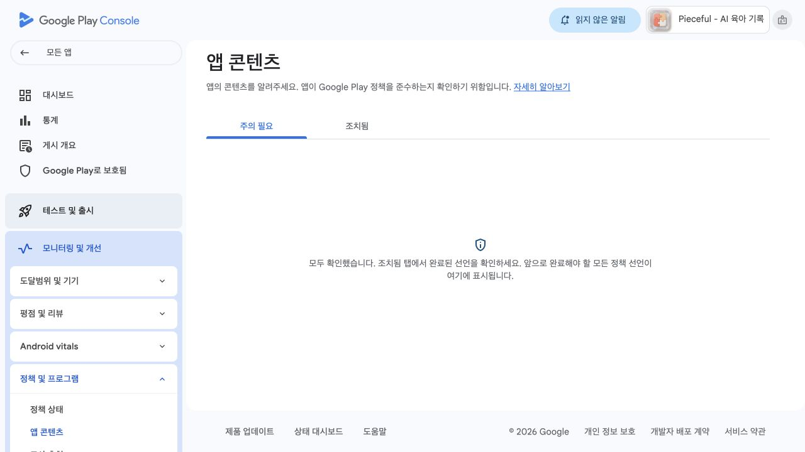
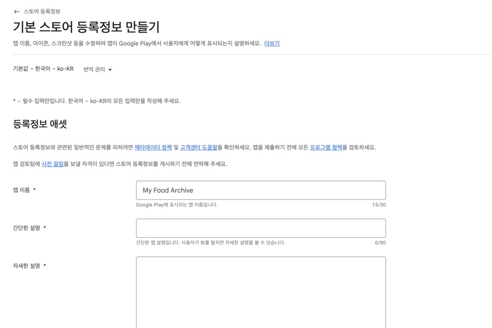

# Android 공개 가이드: 비공개 테스트에서 Google Play 공개까지

이 문서는 책 17~18장을 읽는 Android 독자가 실제 작업 순서대로 사용하는 짧은 경로입니다. 내부 테스트 설치까지 끝내지 않았다면 먼저 [15~16장 내부 테스트 가이드](google-play-internal-test-guide.md)의 1~11절을 진행하세요.

책과 온라인 자료를 번갈아 보지 않도록, 한 번 열었을 때 아래 범위를 끝냅니다.

| 지금 읽는 곳 | 이 문서에서 한 번에 진행할 범위 | 책으로 돌아갈 곳 |
|---|---|---|
| 책 17장 | 1~7절 | 책 17.5절 |
| 책 18장 | 8~10절 | 책 18.3절 |

## 시작 전에 알아둘 시간

- 앱 콘텐츠와 스토어 등록정보 작성: 보통 1~2시간
- 비공개 테스트: 최소 12명이 14일 동안 연속 opt-in
- 프로덕션 접근 신청과 앱 심사: 계정과 앱 상태에 따라 추가 시간이 필요

`opt-in`은 참여 링크에서 테스트 참여를 선택해 테스터로 등록된 상태를 뜻합니다. 요구 기간 동안 참여를 취소하지 않아야 합니다.

따라서 17장에서 설정을 마쳐도 18장을 읽는 날 바로 정식 링크가 생긴다고 보장할 수 없습니다. 승인 전에는 비공개 테스트 링크를 준비하고, 정식 링크가 생기면 교체합니다.

## 1. 앱 콘텐츠부터 완료하기

Play Console에서 **모니터링 및 개선 → 정책 및 프로그램 → 앱 콘텐츠**로 이동합니다.



화면에 표시되는 모든 선언을 완료합니다. 2026년 7월 기준으로 다음 항목이 나타날 수 있습니다.

- 개인정보처리방침
- 광고
- 앱 액세스 또는 로그인 세부정보
- 콘텐츠 등급
- 타겟층 및 콘텐츠
- 데이터 보안
- 광고 ID
- 정부 앱
- 금융 기능
- 건강 앱

이 앱은 로그인, 광고, 금융, 건강, 정부 기능을 제공하지 않습니다. 다만 화면 문구와 실제 코드를 함께 확인한 뒤 답하고, 보이지 않는 항목을 억지로 찾지는 않습니다.

## 2. 개인정보처리방침을 공개하고 앱 안에서도 연결하기

이 저장소의 [개인정보처리방침 참고본](../privacy-policy.md)을 실제 앱 동작과 문의 채널에 맞게 검토합니다.

공개 URL은 다음 조건을 만족해야 합니다.

- 로그인 없이 열림
- 지역 제한이 없음
- PDF가 아님
- 사용자가 내용을 편집할 수 없음
- 앱 이름, 개발자, 문의 수단, 처리 데이터, 제3자 서비스, 보관·삭제 정책 포함

Play Console의 개인정보처리방침 칸에 URL을 넣고, 앱 내부의 **정보 아이콘 → 앱 정보 및 개인정보처리방침**에서도 같은 내용을 확인합니다.

## 3. 데이터 보안 답변을 실제 코드와 맞추기

“기록이 기기에만 저장된다”와 “선택한 사진이 AI 분석을 위해 외부로 전송된다”를 구분합니다.

| 데이터 | 실제 동작 | 답변 전 확인할 점 |
|---|---|---|
| 식당명·메뉴명·카테고리 | Hive에 로컬 저장 | 개발자 서버 전송 없음 |
| 선택한 음식 사진 | 로컬 복사 후 Firebase AI Logic/Gemini로 전송 | 사용자 선택 데이터, 앱 기능 목적, 전송 중 암호화 여부 |
| 사진의 날짜·위치 메타데이터 | 앱이 로컬에서 읽음. 원본 사진에 포함된 메타데이터가 AI 전송 파일에 남을 수 있음 | 사진과 위치 데이터 항목을 함께 검토 |
| Firebase 설치 식별자 | Firebase SDK가 처리할 수 있음 | “기기 또는 기타 ID”와 SDK 공식 안내 확인 |
| App Check·Play Integrity 정보 | 앱/기기 무결성 검증에 사용 | 보안·사기 방지 목적 확인 |

Google Play의 정의에서 `수집`은 앱 밖으로 전송되는 데이터를 포함합니다. `공유` 여부와 일시 처리 예외는 Firebase/Google의 최신 SDK 안내와 실제 프로젝트 설정을 확인해 답합니다. 확신이 없으면 저장하지 말고 공식 문서나 Play Console 지원에 확인합니다.

## 4. 기본 스토어 등록정보 작성하기

**사용자 늘리기 → 앱 정보 → 스토어 등록정보 → 기본 스토어 등록정보 만들기**로 이동합니다.



준비할 항목:

- 앱 이름
- 간단한 설명 80자 이내
- 자세한 설명
- 512×512 앱 아이콘
- 1024×500 기능 그래픽
- Android 휴대전화 스크린샷 2장 이상

사용할 수 있는 실제 Android 화면은 [`docs/book-screenshots/android-app/`](../book-screenshots/android-app/)에 있습니다. 실제 앱에 없는 기능이나 화면을 스토어 설명에 넣지 않습니다.

## 5. Firebase AI와 Play Integrity를 릴리스 설치본으로 확인하기

비공개 테스트를 시작하기 전에 다음을 모두 확인합니다.

1. Firebase 프로젝트에 Android 앱과 패키지 이름이 등록되어 있다.
2. `google-services.json`과 `firebase_options.dart`에 Android 설정이 있다.
3. 앱은 Debug에서 App Check Debug Provider, Release에서 Play Integrity를 사용한다.
4. Play Console의 앱 무결성에서 Firebase/Google Cloud 프로젝트를 연결했다.
5. Play App Signing의 **앱 서명 인증서 SHA-256**을 Firebase Android 앱에 등록했다.
6. Firebase Console → App Check → API에서 Firebase AI Logic enforcement 상태를 확인했다.
7. 내부 테스트 링크로 설치한 앱에서 음식 사진을 골랐을 때 메뉴명과 카테고리가 자동으로 채워졌다.

7번이 실패하면 비공개 테스트를 시작하지 않습니다. 네트워크, Firebase Android 앱 등록, App Check, Play Integrity와 앱 서명 SHA를 먼저 고칩니다.

## 6. 비공개 테스트 시작하기

새 개인 개발자 계정이라면 프로덕션 접근 신청 전에 최소 12명의 테스터가 14일 동안 연속으로 비공개 테스트에 opt-in해야 합니다. Play Console에 표시되는 계정별 안내가 최종 기준입니다.

1. **테스트 및 출시 → 테스트 → 비공개 테스트**로 이동합니다.
2. 이메일 목록, CSV 또는 Google Group으로 테스터를 추가합니다.
3. 피드백 이메일 또는 URL을 입력합니다.
4. 내부 테스트에서 검증한 AAB를 비공개 테스트로 승격하거나 새 버전을 올립니다.
5. 참여 링크와 기능 체크리스트를 테스터에게 보냅니다.
6. 14일 동안 opt-in 인원이 12명 아래로 내려가지 않게 확인합니다.

12명에 딱 맞추기보다 15명 정도를 모집하면 이탈에 대비하기 쉽습니다. 앱 설치와 실제 사용 기록, 피드백, 수정 내역을 남기되 별점·공개 리뷰·설치 수 조작을 요청하지 않습니다.

## 7. 프로덕션 접근 신청하기

14일 조건을 충족하면 Play Console 대시보드에서 프로덕션 접근을 신청합니다.

다음 내용을 사실대로 정리합니다.

- 테스터 모집 방법과 인원
- 테스트 기간
- 실제로 확인한 기능
- 받은 피드백
- 피드백으로 수정한 내용
- 정식 공개 준비가 되었다고 판단한 근거

접근 승인은 자동이 아니며 추가 테스트를 요구받을 수 있습니다.

> **책으로 돌아갈 시점:** 17장을 읽는 중이라면 여기까지 한 번에 진행한 뒤 책 17.5절로 돌아갑니다.

## 8. 프로덕션 트랙으로 출시하기

프로덕션 접근이 승인되면 다음 순서로 진행합니다.

1. **테스트 및 출시 → 프로덕션 → 새 버전 만들기**
2. 검증된 비공개 테스트 버전을 승격하거나 더 높은 `versionCode`의 AAB 업로드
3. 출시 노트 작성
4. 오류·경고 검토
5. 첫 출시라면 단순하게 100% 출시 선택
6. Google 심사 제출

## 9. 정식 링크 확인하기

승인 후 다음 형식의 링크를 실제 Android폰에서 확인합니다.

```text
https://play.google.com/store/apps/details?id=[내 패키지 이름]
```

정식 링크가 아직 없다면 비공개 테스트 참여 링크가 실제 Android폰에서 열리는지 확인합니다. 수정 요청을 받으면 요청 문장을 그대로 복사해 원인, 코드 수정, Play Console 수정으로 나눠 처리합니다.

## 10. 마지막 점검

- [ ] 광범위한 사진 권한 없이 Photo Picker 사용
- [ ] Target SDK가 현재 Play 최소 요구사항 이상
- [ ] 개인정보처리방침 공개 URL과 앱 내부 화면 일치
- [ ] 데이터 보안 답변과 실제 AI 사진 전송 일치
- [ ] 앱 콘텐츠의 모든 선언 완료
- [ ] 스토어 등록정보와 Android 스크린샷 완료
- [ ] 내부 테스트 설치본에서 Gemini 분석 성공
- [ ] 비공개 테스트 12명·14일 충족
- [ ] 프로덕션 접근 승인
- [ ] 프로덕션 심사 통과와 정식 링크 확인

> **책으로 돌아갈 시점:** 18장을 읽는 중이라면 여기까지 한 번에 진행한 뒤 책 18.3절로 돌아갑니다. 18.4절에서 첫 사용자에게 보낼 링크는 정식 링크가 있으면 정식 링크를, 아직 승인 전이면 비공개 테스트 링크를 사용합니다.

## 공식 문서

- Google Play Target API 요구사항: https://support.google.com/googleplay/android-developer/answer/11926878
- 신규 개인 개발자 계정 테스트 요구사항: https://support.google.com/googleplay/android-developer/answer/14151465
- 사진 및 동영상 권한 정책: https://support.google.com/googleplay/android-developer/answer/15800983
- 데이터 안전 양식: https://support.google.com/googleplay/android-developer/answer/10787469
- Firebase AI Logic App Check: https://firebase.google.com/docs/ai-logic/app-check
