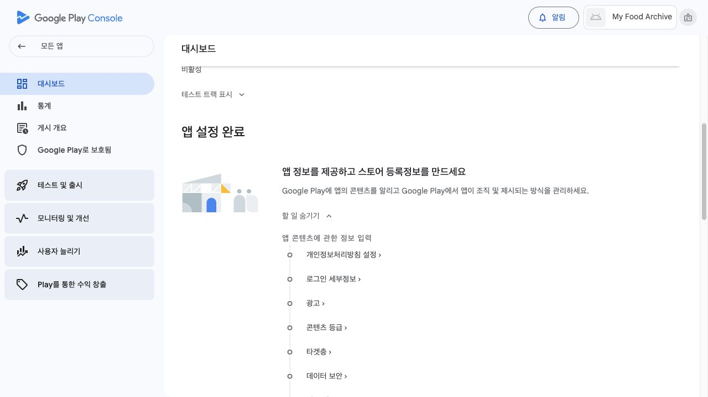
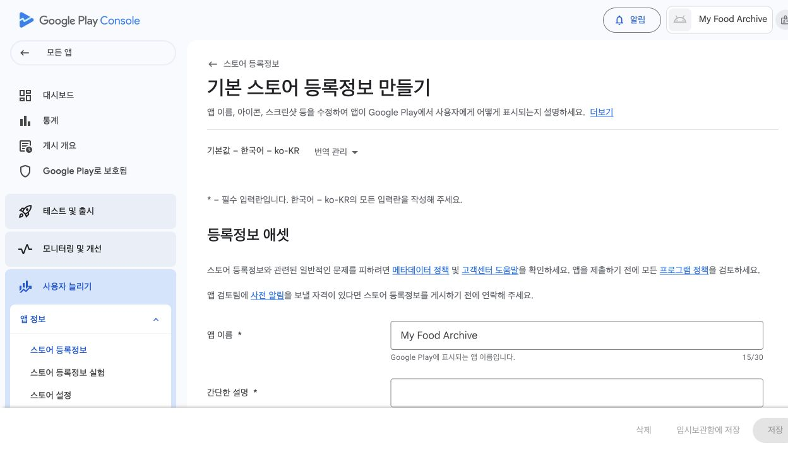
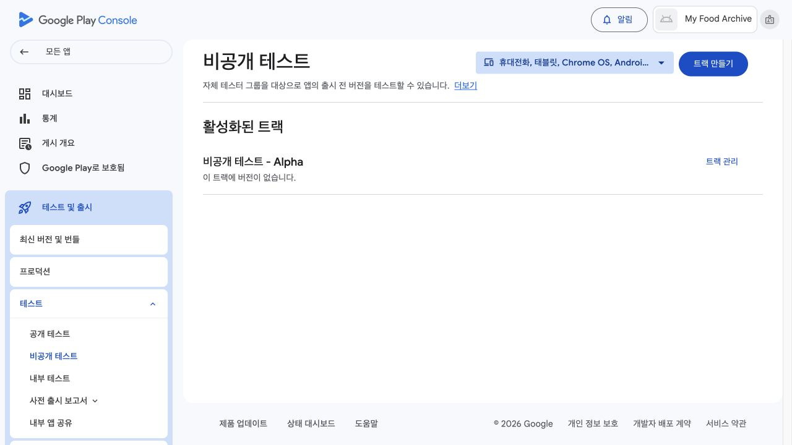
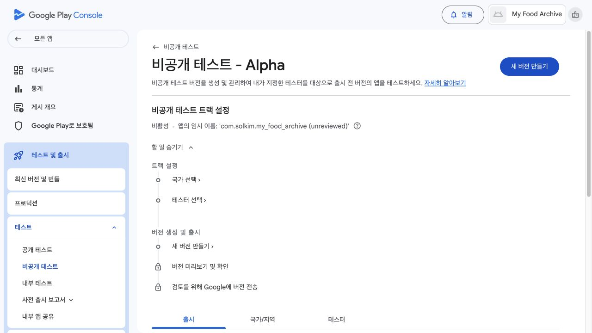
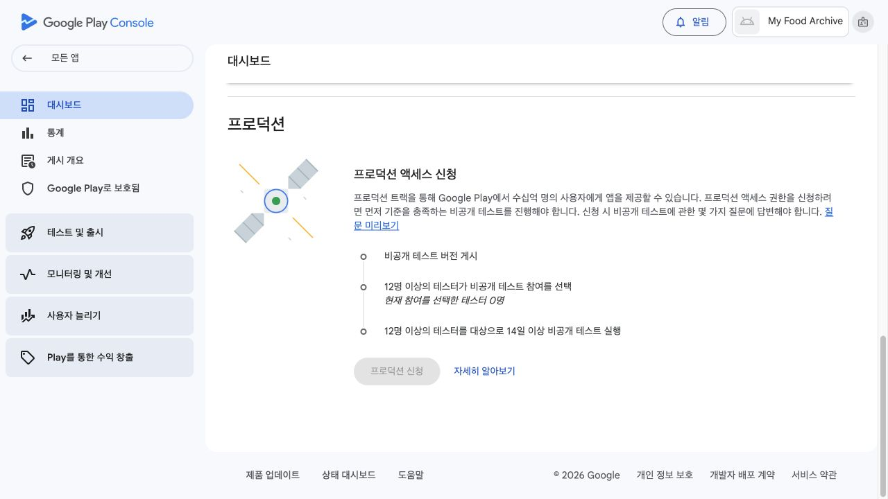

# Android 공개 가이드: 비공개 테스트에서 Google Play 공개까지

이 문서는 책 17~18장을 읽는 Android 독자가 사용합니다. 내부 테스트 설치까지 끝내지 않았다면 먼저 [15~16장 내부 테스트 가이드](google-play-internal-test-guide.md)의 1~11절을 진행합니다. 9.1절은 16장에서 사용합니다.

Play Console에 비공개 테스트 요구사항이 표시되는 계정은 최소 14일의 테스트를 마쳐야 프로덕션 접근을 신청할 수 있습니다. 지금 읽는 장에 해당하는 표에서 현재 상태 한 행만 진행합니다.

### 책 17장에서 처음 열었을 때

| Play Console 상태 | 진행할 범위 | 책으로 돌아갈 곳 |
|---|---|---|
| 비공개 테스트 요구사항이 표시됨 | 1~6절에서 점검과 비공개 테스트 시작 | 책 17.7절 |
| 비공개 테스트 요구사항이 표시되지 않고 프로덕션을 사용할 수 있음 | 1~5절을 마친 뒤 8절에서 출시 제출 | 책 17.7절 |

### 책 18장에서 다시 열었을 때

| Play Console 상태 | 진행할 범위 | 책으로 돌아갈 곳 |
|---|---|---|
| 아직 프로덕션 접근을 신청할 수 없음 | 9절의 링크 선택표에서 비공개 테스트 링크 확인 | 책 18.3절 |
| 프로덕션 접근을 신청할 수 있지만 아직 신청하지 않음 | 7절에서 신청한 뒤 9절의 링크 선택표에서 비공개 테스트 링크 확인 | 책 18.3절 |
| 프로덕션 접근이 승인됐고 출시 미제출 | 8~9절 | 책 18.3절 |
| 프로덕션 출시를 제출했고 앱 심사 중 | 9절의 승인·심사 대기 경로 | 책 18.3절 |
| 앱 심사 승인·게시 대기 | 9절의 게시 대기 경로 | 책 18.3절 |
| Google Play 공개 링크가 실제로 열림 | 9절의 정식 공개 경로 | 책 18.3절 |

### 요청이 돌아왔을 때

| Play Console 상태 | 진행할 범위 | 다음 이동 |
|---|---|---|
| 프로덕션 접근 신청 뒤 추가 테스트 요청 | 6절에서 테스트를 계속하고, 다시 신청 가능 상태가 표시되면 7절 | 기다리는 동안 9절을 거쳐 책 18.3절 |
| 프로덕션 심사에서 변경 요청 | 8절의 수정 요청 경로 | 수정·제출 후 9절을 거쳐 책 18.3절 |

`opt-in`은 참여 링크에서 테스트 참여를 선택한 상태입니다. Play Console에 이 요구사항이 표시되는 새 개인 개발자 계정은 12명 이상이 최근 14일 동안 연속으로 이 상태를 유지해야 프로덕션 접근을 신청할 수 있습니다. 최종 기준은 Play Console에 표시되는 계정별 안내입니다.

상태표에서 **프로덕션 접근 승인**은 프로덕션 트랙을 사용할 권한을 받은 상태이고, **앱 심사 승인**은 제출한 출시 버전의 검토가 끝난 상태입니다. 앱 심사가 승인돼도 Google Play 페이지가 모든 지역에 반영되는 **게시 중** 단계가 남을 수 있습니다. 실제 공개 완료는 Google Play 링크가 Android폰에서 열릴 때 확인합니다.

## 1. 앱 콘텐츠 입력 준비하기

Play Console 앱 대시보드에서 [앱 설정 완료] → [앱 정보를 제공하고 스토어 등록정보를 만드세요] → [할 일 보기]를 엽니다.



개인정보처리방침, 광고, 앱 액세스, 콘텐츠 등급, 타겟층, 데이터 보안 같은 항목이 표시됩니다. 화면에 필수 작업으로 표시된 항목을 하나씩 처리합니다.

답을 추측하지 않습니다. Play Console의 질문을 복사하고 클로드 코드가 실제 프로젝트와 비교하게 합니다.

```text
Google Play 앱 콘텐츠를 작성하려고 해.
이 프로젝트의 실제 동작을 확인하고, 아래 질문에 넣을 답과 근거를 정리해줘.
코드나 문서에서 고칠 수 있는 부분은 직접 고치고, 내가 Play Console에서 선택할 내용만 알려줘.
각 답은 확정, 확인 필요, 근거로 나눠 표시해줘.

[Play Console 질문 붙여넣기]
```

각 항목은 같은 순서로 진행합니다.

1. 항목을 엽니다.
2. 질문을 위 프롬프트에 붙여 넣습니다.
3. 확인된 답을 Play Console에 입력합니다.
4. 저장하거나 제출합니다.
5. 대시보드에서 해당 항목이 완료 상태인지 확인합니다.

마이 맛집 아카이브는 로그인, 광고, 금융, 건강, 정부 기능을 제공하지 않습니다. 다만 독자의 프로젝트가 달라졌다면 클로드 코드가 확인한 실제 동작을 기준으로 답합니다.

광고, 앱 액세스, 콘텐츠 등급과 타겟층처럼 지금 답할 수 있는 항목은 완료 상태까지 진행합니다. 개인정보처리방침과 데이터 보안은 2~3절에서 준비하므로 해당 항목을 남겨 두고 2절로 이동합니다.

## 2. 개인정보처리방침 공개하기

[개인정보처리방침 참고본](../privacy-policy.md)은 저자 앱의 실제 값이 들어 있는 예시입니다. 개발자 이름과 문의 주소를 그대로 복사하지 않습니다.

먼저 클로드 코드에게 앱과 방침을 비교하게 합니다.

```text
이 프로젝트의 실제 데이터 처리와 docs/privacy-policy.md를 비교해줘.
앱 이름, 개발자 이름, 시행일, 문의 방법은 내가 확인할 수 있게 표시하고,
앱 동작과 다른 내용은 직접 수정해줘.
```

수정된 방침에서 다음 다섯 항목을 직접 확인합니다.

1. 내 앱 이름
2. Google Play에 표시할 개발자 이름
3. 시행일
4. 내가 답할 수 있는 문의 이메일 또는 지원 페이지
5. 사진의 AI 전송과 기기 내 저장·삭제 방식

기본 경로는 책 17장의 iPhone 사례와 같은 Notion 공개 페이지입니다.

1. Notion에서 새 페이지를 만듭니다.
2. 확인이 끝난 개인정보처리방침을 붙여 넣습니다.
3. [공유] → [게시]에서 웹 공개를 켭니다.
4. 공개 링크를 복사해 로그아웃 상태나 시크릿 창에서 열어 봅니다.

Notion을 사용하지 않는다면 본인의 GitHub Pages나 웹사이트에 게시해도 됩니다. PDF, 로그인을 요구하는 문서, 편집 권한이 필요한 주소는 사용하지 않습니다.

공개 URL을 Play Console의 개인정보처리방침 칸에 넣습니다. 앱 내부의 [정보 아이콘] → [앱 정보 및 개인정보처리방침]에서도 같은 내용이 열려야 합니다. 앱 내부 내용이 다르면 클로드 코드에게 URL과 문구를 맞추게 하고, 새 내부 테스트 버전을 올립니다.

## 3. 데이터 보안 답변 작성하기

이 앱의 데이터 흐름은 두 가지로 나뉩니다.

- 식당명과 맛집 기록은 기기 안에 저장됩니다.
- 사용자가 고른 사진은 메뉴명과 카테고리 분석을 위해 Firebase AI Logic을 거쳐 외부 AI 서비스로 전송됩니다.

사진에는 촬영 날짜나 위치 정보가 포함될 수 있고, Firebase가 앱 보호를 위한 식별 정보를 처리할 수 있습니다. 이 판단을 독자가 기술 문서만 보고 직접 내리지 않습니다.

Play Console의 데이터 보안 질문을 한 화면씩 복사해 1절의 프롬프트로 확인합니다. 클로드 코드의 답에서 **확인 필요**로 표시된 항목만 Firebase 공식 안내나 Play Console 지원에 문의합니다. 답변을 저장한 뒤에는 개인정보처리방침과 서로 모순되지 않는지 다시 비교하게 합니다.

## 4. 스토어 등록정보와 이미지 준비하기

[사용자 늘리기] → [앱 정보] → [스토어 등록정보] → [기본 스토어 등록정보 만들기]로 이동합니다.



클로드 코드에게 앱 설명과 이미지 규격 준비를 한 번에 맡깁니다. 기능 그래픽은 스토어 상단에서 앱을 소개하는 가로 이미지입니다.

```text
Google Play 기본 스토어 등록정보를 준비해줘.
실제 앱 기능만 사용해 간단한 설명과 자세한 설명을 작성하고,
현재 앱 아이콘과 기능 그래픽을 Google Play 규격에 맞게 준비해줘.
내가 직접 찍어야 하는 앱 스크린샷은 화면 이름만 알려줘.
완성한 이미지마다 파일 경로와 픽셀 크기를 알려줘.
```

준비할 결과물은 다음과 같습니다.

- 앱 이름
- 80자 이내의 간단한 설명
- 실제 기능을 설명하는 자세한 설명
- 512×512 앱 아이콘
- 1024×500 기능 그래픽
- Android 휴대전화 스크린샷 2장 이상
- 앱 카테고리와 필요한 태그
- 사용자가 문의할 수 있는 지원 이메일
- Play Console이 필수로 표시한 개발자 연락처. 웹사이트나 전화번호가 선택 항목이면 실제로 운영할 수 있을 때만 입력

스크린샷은 독자의 내부 테스트 설치본에서 직접 촬영한 원본을 사용합니다. 홈, 사진을 고른 뒤 자동 입력된 화면, 저장 결과, 검색 결과 중 앱의 핵심이 잘 이어지는 화면을 고릅니다. 자르기·가림·합성·주석을 하지 않습니다.

[저자 앱의 Android 화면](app-screenshot-reference.md)은 어떤 장면을 고를지 보는 참고 예시입니다. 독자의 앱 화면이나 데이터가 다르면 제출 이미지로 사용하지 않습니다.

Play Console에서 필수로 표시된 칸을 모두 입력하고 저장한 뒤, 기본 스토어 등록정보가 완료 상태인지 확인합니다. 완료되지 않은 항목이 남으면 화면의 항목 이름을 클로드 코드에게 보내 다음 입력값을 확인합니다.

클로드 코드가 기능 그래픽 파일을 만들 수 없는 환경이라면 [Canva](https://www.canva.com/)에서 1024×500px 사용자 지정 크기를 만들고, 앱 아이콘과 앱의 핵심을 보여 주는 짧은 문구로 구성합니다. 완성 파일은 PNG 또는 JPEG로 내려받고 파일 크기가 1024×500px인지 확인합니다.

앱 대시보드로 돌아가 앱 콘텐츠 필수 항목과 기본 스토어 등록정보가 모두 완료 상태인지 확인한 뒤 5절로 이동합니다.

## 5. Google Play 설치본에서 사진 AI 자동 입력 확인하기

15장의 내부 테스트 가이드에서 App Check 강제 적용 뒤 사진 AI 자동 입력까지 확인했다면 같은 설정을 다시 입력하지 않습니다. 아직 확인하지 못했거나 기능이 실패할 때만 아래 문장을 사용합니다.

```text
Google Play 내부 테스트 설치본에서 사진 AI 자동 입력이 동작하도록 필요한 설정을 점검하고 직접 고쳐줘.
내가 웹에서 해야 할 일만 순서대로 알려줘.
```

클로드 코드가 빠진 작업이 있다고 알려 줄 때만 15장의 [첫 업로드 뒤 Firebase 연결 단계](google-play-internal-test-guide.md#75-첫-업로드-뒤-앱-서명-정보를-firebase에-연결하기)로 돌아갑니다.

클로드 코드가 새 빌드가 필요하다고 판단하면 `versionCode`를 올려 AAB를 다시 만들고 내부 테스트에 올립니다. Google Play 내부 테스트 링크로 설치한 앱에서 음식 사진 한 장을 골라 메뉴명과 카테고리가 자동으로 채워지는지 확인합니다. 실패하면 오류 화면이나 문장을 클로드 코드에게 보내 원인을 고칩니다.

비공개 테스트를 시작하기 전에 앱 설명과 실제 동작을 비교합니다. 이 과정은 책 17.5절의 Android 점검을 대신합니다.

```text
Google Play 비공개 테스트와 정식 공개 준비 전에 막힐 부분을 비판적으로 검토해줘.
```

검토 결과를 읽은 뒤 수정할 항목이 있으면 다음 문장으로 이어 갑니다.

```text
방금 찾은 문제를 우선순위대로 고쳐줘. 내가 확인할 화면 작업만 알려줘.
```

필요한 수정을 새 내부 테스트 버전에서 다시 확인한 뒤 6절로 이어 갑니다.

## 6. 비공개 테스트 시작하기

5절의 점검과 필요한 수정을 마친 뒤 비공개 테스트를 시작합니다.

테스터 이메일 목록이나 Google Group이 아직 없다면 먼저 [테스터 모집 안내](tester-recruitment.md)에서 직접 모집, 크몽 같은 유료 서비스, 개발자 커뮤니티 품앗이 방법 중 하나를 선택합니다. 등록할 계정 목록을 준비한 뒤 아래 순서로 이어 갑니다.

1. [테스트 및 출시] → [테스트] → [비공개 테스트]로 이동합니다.



2. 기존 트랙이 보이면 [트랙 관리]를 누릅니다. 트랙이 없다면 [트랙 만들기]를 눌러 이름을 입력하고 트랙을 만듭니다.
3. [테스터] 탭에서 이메일 목록, CSV 또는 Google Group 중 한 가지 방법으로 테스터를 추가합니다. Google Group을 사용한다면 테스터가 먼저 그룹 가입을 마쳤는지 확인합니다.
4. 피드백을 받을 이메일 또는 URL을 입력하고 [변경사항 저장]을 누릅니다.
5. [국가/지역] 탭을 열어 실제 테스터가 있는 국가와 지역이 포함됐는지 확인하고 저장합니다. 메뉴 위치가 다르면 생략하지 않고 현재 화면을 클로드 코드에게 보여 줍니다.
6. [출시] 탭으로 이동하고 아래 두 경로 중 하나만 선택해 비공개 테스트 버전을 준비합니다.
7. 출시 노트를 입력하고 [검토]로 이동합니다.
8. 오류가 있으면 해결한 뒤 [출시 시작], [변경사항 전송] 또는 현재 화면에 표시된 제출 버튼을 누릅니다.
9. 비공개 테스트 화면에서 출시 상태를 확인합니다.



| 현재 준비 상태 | 진행 방법 | 완료 기준 |
|---|---|---|
| 내부 테스트에서 확인한 버전을 그대로 사용 | 내부 테스트 버전의 [트랙으로 승격] 또는 비슷한 버튼에서 [비공개 테스트] 선택 | 비공개 테스트 출시 화면에 같은 `versionCode`가 포함됨 |
| 앱을 수정해 새 AAB가 있음 | 비공개 테스트에서 [새 버전 만들기]를 눌러 새 AAB 업로드 | 비공개 테스트 출시 화면에 새 `versionCode`가 포함됨 |

버전이 트랙에 표시되기만 하면 아직 초안일 수 있습니다. 아래 상태에 맞춰 진행합니다.

| 출시 상태 | 할 일 |
|---|---|
| 초안 또는 제출 전 | 출시 화면으로 돌아가 검토와 제출을 마침 |
| 검토 중 또는 처리 중 | 같은 AAB를 다시 올리지 않고 기다림 |
| 비공개 테스터에게 제공됨 또는 이에 해당하는 공개 상태 | [테스터] 탭에서 참여 링크를 복사함 |

참여 링크는 등록한 Google 계정으로 실제 Android폰에서 열어 봅니다. 참여 화면과 [설치] 또는 [업데이트] 버튼이 보일 때만 확인할 기능과 함께 테스터에게 보냅니다.

12명 이상이 동시에 참여 상태가 된 뒤부터 조건이 쌓입니다. 앱 설치와 실제 사용도 함께 요청하고, 중간 이탈에 대비해 15명 정도를 모집합니다. 참여자가 빠지면 신청 가능 상태가 표시되는 시점이 늦어질 수 있습니다.

| 시점 | 확인할 내용 |
|---|---|
| 시작일 | Play Console의 프로덕션 접근 요건 카드 또는 비공개 테스트 요약에서 실제 참여 인원이 12명 이상인지, 참여 링크가 열리는지 확인 |
| 테스트 중간 | 참여 인원과 받은 피드백 확인, 발견된 문제 수정 |
| 14일 이후 | Play Console에 프로덕션 접근 신청 가능 상태가 표시되는지 확인 |



위 화면처럼 현재 참여 인원과 남은 조건은 Play Console 대시보드의 [프로덕션 액세스 신청] 카드에서 확인합니다. 버튼이 비활성화돼 있으면 카드에 표시된 조건을 계속 충족합니다.

테스터 이메일 목록에 등록한 인원수가 아니라 참여 링크에서 opt-in을 마친 실제 참여 인원을 확인합니다. 날짜를 직접 계산해 종료하지 않고 Play Console에 신청 가능 상태가 표시될 때까지 참여를 유지합니다.

테스트 중간에 앱을 고쳤다면 먼저 데이터 처리, 권한, 앱 설명이 달라졌는지 클로드 코드에게 확인하게 합니다. 달라졌다면 2~4절의 개인정보처리방침, 데이터 보안 답변과 스토어 정보를 함께 갱신합니다. 이어서 `versionCode`를 올려 AAB를 다시 만들고 비공개 테스트에 게시한 뒤 수정된 기능을 다시 확인합니다.

내부 테스트에 참여했던 Google 계정으로 비공개 버전이 보이지 않으면 다음 순서로 확인합니다.

1. 비공개 테스트 출시 상태가 [비공개 테스터에게 제공됨] 또는 이에 해당하는 상태인지 확인합니다.
2. [테스터] 탭에서 목록·그룹과 피드백 주소를 저장했는지 확인합니다.
3. Google Group을 사용한다면 테스터 계정이 그룹 가입을 마쳤는지 확인합니다.
4. 내부 테스트 참여 페이지에서 [프로그램 나가기] 또는 [테스트 종료]를 누릅니다.
5. Play Store가 비공개 테스터로 등록한 Google 계정으로 열려 있는지 확인합니다.
6. 비공개 테스트 참여 링크를 다시 엽니다.
7. Android폰에서 [설치] 또는 [업데이트]가 보이는지 확인합니다.

비공개 테스트를 시작했다면 책 17.5~17.6절의 iOS 점검과 제출 화면은 건너뛰고 17.7절로 돌아갑니다. 테스트 기간에는 참여 인원과 피드백을 기록하고, Play Console에 신청 가능 상태가 표시되면 이 문서의 7절만 다시 엽니다.

## 7. 프로덕션 접근 신청하기

Play Console에 프로덕션 접근 신청 가능 상태가 표시되면 신청을 시작합니다.

Play Console 대시보드에서 [프로덕션 액세스 신청] 또는 현재 화면의 신청 버튼을 누릅니다. 화면에 나온 질문을 모두 복사한 뒤, 대상 사용자, 앱이 주는 가치, 예상 설치 범위, 테스터 모집·소통 방식, 실제로 사용한 기능, 참여도, 받은 피드백, 수정 내용, 프로덕션 준비 판단 근거를 클로드 코드에게 전달해 답변 초안을 받습니다.

```text
Google Play 프로덕션 접근 신청 답변을 작성해줘.
아래 질문에 맞춰 확인되는 사실만 사용하고, 과장하거나 없던 테스트를 만들지 마.

[Play Console에 표시된 전체 질문]

[대상 사용자, 앱의 가치, 예상 설치 범위, 테스트 기간과 인원,
모집·소통 방식, 사용 기능, 참여도, 피드백, 수정 내역,
프로덕션 준비 판단 근거]
```

답변을 읽고 실제 기록과 맞는지 확인한 뒤 Play Console에 입력합니다. 각 화면에서 [다음]을 눌러 저장하고 마지막 화면의 [신청], [프로덕션 액세스 신청] 또는 현재 화면의 최종 제출 버튼을 누릅니다. 대시보드에 [검토 중] 또는 이에 해당하는 상태가 표시돼야 신청이 끝난 것입니다. 접근 승인은 자동이 아니며 추가 테스트를 요청받을 수 있습니다. 책 17.7절을 이미 읽었으므로 신청을 마치면 18장으로 이동합니다. 18장에서는 현재 승인 상태에 따라 이 문서 9절 또는 8~9절을 사용합니다.

추가 테스트 요청을 받으면 요청 사유를 클로드 코드에게 보내 수정할 항목과 다시 테스트할 기능을 나눕니다. 비공개 테스트를 계속 진행하고, Play Console에 다시 신청할 수 있는 상태가 표시되면 7절을 다시 진행합니다.

## 8. 승인 후 프로덕션 트랙으로 출시하기

프로덕션 접근이 승인된 뒤에만 이 절을 진행합니다.

1. [테스트 및 출시] → [프로덕션]으로 이동합니다.
2. [국가/지역] 또는 비슷한 메뉴에서 공개할 국가와 지역을 선택하고 저장합니다.
3. 아래 두 경로 중 현재 화면에 보이는 하나만 사용합니다.

| 시작 화면 | 진행 방법 |
|---|---|
| 프로덕션 트랙 | [새 버전 만들기] 또는 [새 출시 만들기] → [라이브러리에서 추가] → 비공개 테스트에서 설치해 확인한 `versionCode` 선택 |
| 비공개 테스트 출시 상세 | [트랙으로 승격], [버전 승급] 또는 비슷한 버튼 → [프로덕션] 선택 |


4. 프로덕션 버전의 포함된 App Bundle 목록에 확인한 `versionCode`가 표시되는지 확인합니다.
5. 출시 노트를 입력하고 [검토]로 이동합니다.
6. 화면의 오류와 경고를 클로드 코드에게 보여 주고 필요한 항목을 처리합니다.
7. 첫 출시에는 출시 비율 선택이 표시되지 않습니다. [출시 시작], [검토를 위해 변경사항 전송] 또는 현재 화면의 제출 버튼을 누릅니다.

프로덕션에 새 AAB를 직접 올리지 않습니다. 앱을 고쳐 새 AAB가 생겼다면 6절로 돌아가 비공개 테스트에 게시하고 실제 설치본을 확인한 뒤, 확인된 버전을 프로덕션으로 승격합니다.

제출이 끝나면 같은 버전을 다시 만들지 않고 Play Console과 이메일의 심사 결과를 기다립니다. 기다리는 동안에는 9절의 승인·심사 대기 경로로 이동합니다.

수정 요청을 받으면 요청 문장을 그대로 복사해 클로드 코드에게 보냅니다.

- 스토어 문구나 이미지만 수정하는 요청이면 해당 항목을 고치고 다시 제출합니다.
- 앱 수정이 필요한 요청이면 코드를 고치고 `versionCode`를 올린 새 AAB를 만듭니다. 6절로 돌아가 비공개 테스트에서 수정 기능을 확인한 뒤 프로덕션에 새 버전을 제출합니다.
- 심사가 승인되면 8절을 반복하지 않고 9절에서 게시 상태와 정식 링크만 확인합니다.

## 9. 책 18.3절로 돌아가기 전에 링크 확인하기

현재 상태에 맞는 링크 하나만 확인합니다.

### 앱 심사 또는 게시 처리를 기다리는 경우

Play Console에서 [게시 개요] 또는 프로덕션 상태를 확인합니다. 상태가 [검토 중] 또는 [처리 중]이면 심사 결과를 기다립니다. 심사가 승인되고 [게시 중]이면 같은 버전을 다시 제출하지 않고 기다립니다. 첫 출시는 관리형 게시를 사용할 수 없으므로 승인된 변경사항이 자동으로 게시됩니다. Google Play 링크가 실제 Android폰에서 열릴 때 아래 정식 공개 경로로 이동합니다.

### 정식 공개가 끝난 경우

다음 형식의 Google Play 링크를 실제 Android폰에서 엽니다.

```text
https://play.google.com/store/apps/details?id=[내 패키지 이름]
```

앱 페이지가 열리면 링크를 복사하고 책 18.3절로 돌아갑니다.

**Google Play 링크를 건넬 사용자에게 보내는 메시지 예시**

```text
내가 만든 My Food Archive가 Google Play에 올라갔어.
시간 될 때 아래 링크로 설치해서 음식 사진 한 장만 저장해 봐 줘.

[Google Play 정식 링크]

써보고 아래 세 가지만 알려줘.

1. 저장하다가 막힌 곳이 있었는지
2. 저장한 기록을 다시 찾기 쉬웠는지
3. 있으면 좋겠다고 느낀 기능이 있었는지
```

### 아직 승인이나 심사를 기다리는 경우

17장에서 사용한 경로에 따라 현재 테스트 링크를 하나 선택합니다.

| 17장에서 진행한 경로 | 지금 확인할 링크 | 새 사람에게 보낼 때 |
|---|---|---|
| 비공개 테스트 요구사항이 표시되어 6절을 진행함 | 6절에서 만든 비공개 테스트 참여 링크 | Google 계정 이메일을 비공개 테스터 목록에 추가한 뒤 보냄 |
| 비공개 테스트 요구사항이 없어 6절을 건너뛰고 프로덕션에 제출함 | [15~16장 내부 테스트 가이드 8절](google-play-internal-test-guide.md#8-테스터-목록-만들고-참여-링크-받기)에서 만든 내부 테스트 참여 링크 | Google 계정 이메일을 내부 테스터 목록에 추가한 뒤 보냄 |

선택한 링크를 실제 Android폰에서 열고 참여 화면과 설치 또는 업데이트 버튼이 보이는지 확인합니다. 링크가 열리는 것을 확인하면 책 18.3절로 돌아갑니다.

**테스터에게 보내는 메시지 예시**

```text
My Food Archive Android 테스트 버전을 확인해 줘.
아래 링크를 등록된 Google 계정으로 열고 음식 사진 한 장을 저장해 봐 줘.

[현재 테스트 참여 링크]

써보고 아래 세 가지만 알려줘.

1. 설치하거나 저장하다가 막힌 곳이 있었는지
2. 저장한 기록을 다시 찾기 쉬웠는지
3. 있으면 좋겠다고 느낀 기능이 있었는지
```

프로덕션 접근이 승인됐지만 아직 출시를 제출하지 않았다면 8절로 이동합니다. 프로덕션 출시를 이미 제출해 앱 심사 중이라면 8절을 반복하지 않습니다. 앱 심사가 승인되면 이 9절의 게시 상태부터 확인합니다.

## 공식 문서

- [신규 개인 개발자 계정 테스트 요구사항](https://support.google.com/googleplay/android-developer/answer/14151465)
- [내부·비공개·공개 테스트 설정](https://support.google.com/googleplay/android-developer/answer/9845334)
- [데이터 보안 양식](https://support.google.com/googleplay/android-developer/answer/10787469)
- [Google Play 스토어 등록정보와 미리보기 애셋](https://support.google.com/googleplay/android-developer/answer/1078870)
- [Firebase AI Logic App Check](https://firebase.google.com/docs/ai-logic/app-check)
- [App Check Play Integrity 제공자 설정](https://firebase.google.com/docs/app-check/android/play-integrity-provider)
- [Google Play 버전 준비와 출시](https://support.google.com/googleplay/android-developer/answer/9859348)
- [Google Play 검토와 게시 상태](https://support.google.com/googleplay/android-developer/answer/9859654)
